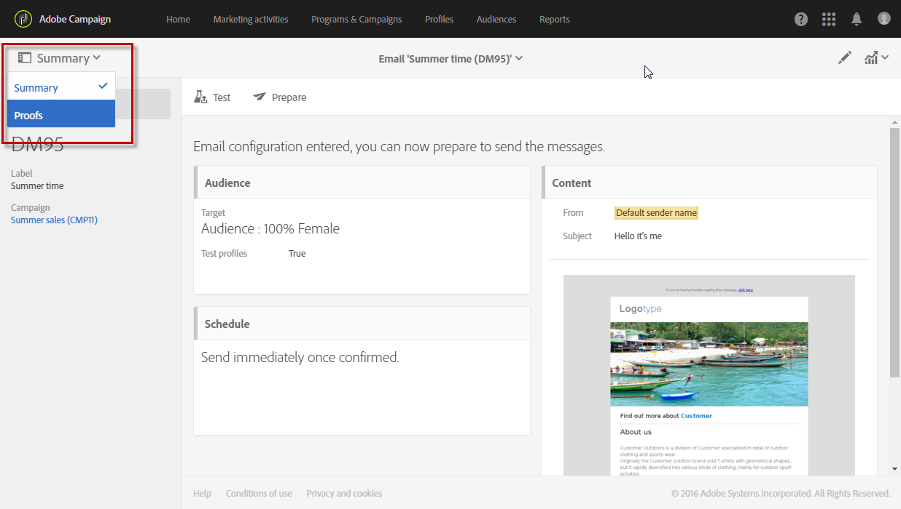

# Invio di prove {#sending-proofs}

Una prova è un messaggio specifico che consente di verificare un messaggio prima di inviarlo alla destinazione principale.

I destinatari della prova hanno il compito di approvare il messaggio (contenuto e modulo). Sono definiti nei profili **di** test. Per ulteriori informazioni, consultate [Gestione dei profili](../../audiences/using/managing-test-profiles.md)di test.

Per inviare una prova, i profili di test devono essere inclusi nel pubblico del messaggio.

In un messaggio:

1. Fate clic sul **[!UICONTROL Send a test]** pulsante.

   

1. Selezionare il tipo di prova da utilizzare:

   * **[!UICONTROL Email rendering]**: selezionate questa opzione per verificare il modo in cui il messaggio viene ricevuto in base alle inbox di destinazione. Per ulteriori informazioni, consultate Rendering [e-](../../sending/using/email-rendering.md)mail.
   * **[!UICONTROL Proof]**: selezionate questa opzione per verificare il messaggio prima di inviarlo alla destinazione principale. I destinatari della prova hanno il compito di approvare la consegna, verificandone il contenuto e il formato.
   * **[!UICONTROL Proof + Email rendering]**: questa opzione combina le due opzioni precedenti.
   

1. Conferma la tua scelta.

   Le prove vengono inviate ai profili di test.

   

1. È possibile visualizzare le prove utilizzando l&#39;elenco a **[!UICONTROL Proofs]** discesa.

   

1. Selezionate una prova per accedere al relativo riepilogo. Per un messaggio e-mail, se avete selezionato l’opzione di rendering **e-mail come tipo di prova, l’** **[!UICONTROL Access email rendering]** icona viene visualizzata a destra dell’etichetta della prova. Consultate Rendering e-mail.

   

A seconda dei commenti delle persone che ricevono la prova, potrebbe essere necessario modificare il contenuto della consegna. Una volta apportate le modifiche, è necessario riavviare la preparazione e-mail e inviare nuovamente una prova. È possibile accedere a ogni nuova prova utilizzando il **[!UICONTROL Show proofs]** pulsante.

Devi inviare tutte le prove necessarie fino a quando non avrai completato il contenuto della consegna. Una volta fatto questo, è possibile inviare la consegna alla destinazione principale e chiudere il ciclo di approvazione.

**Argomento correlato:**

[Invio di un test, preparazione e invio di un video e-mail](https://docs.adobe.com/content/help/en/campaign-learn/campaign-standard-tutorials/getting-started/sending-test-preparing-sending-email.html)
