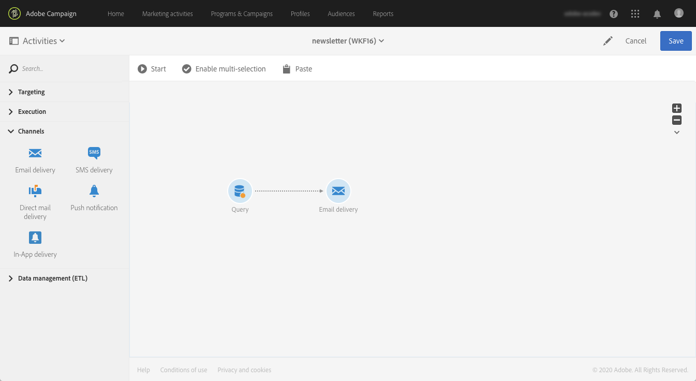
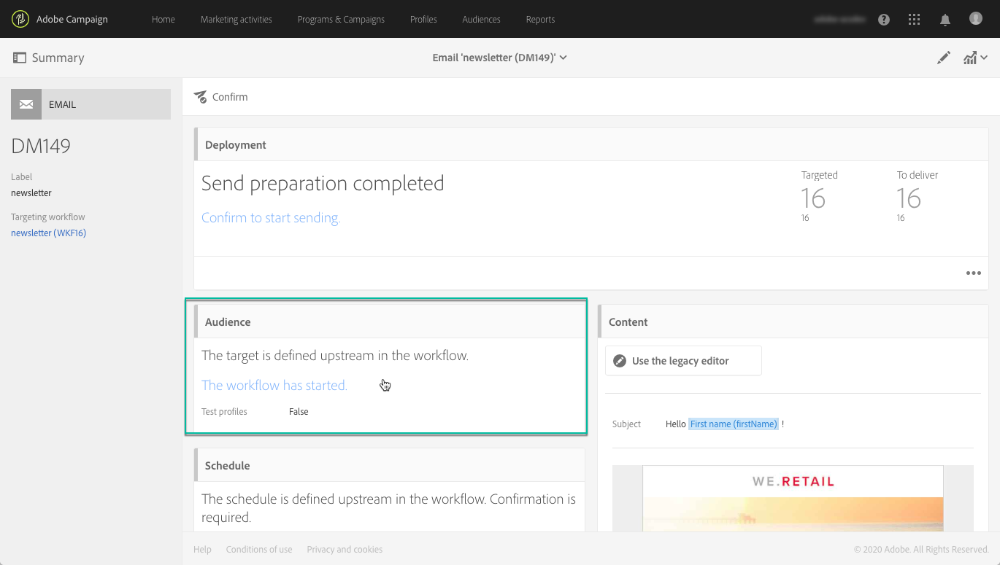
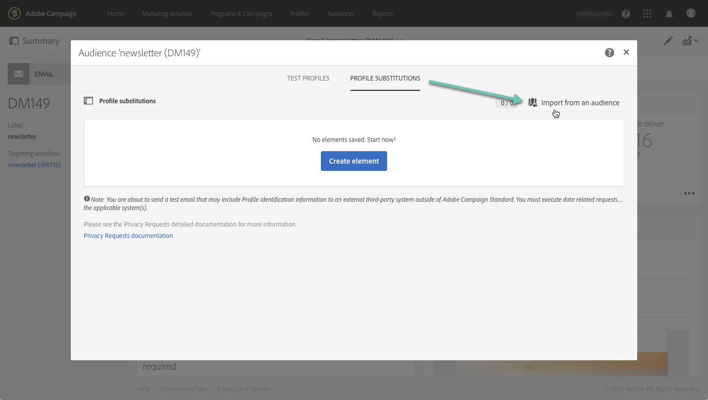
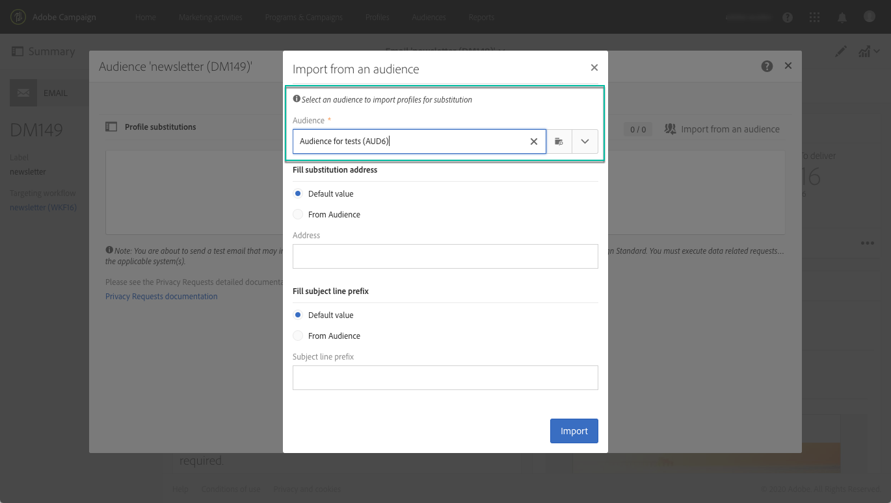
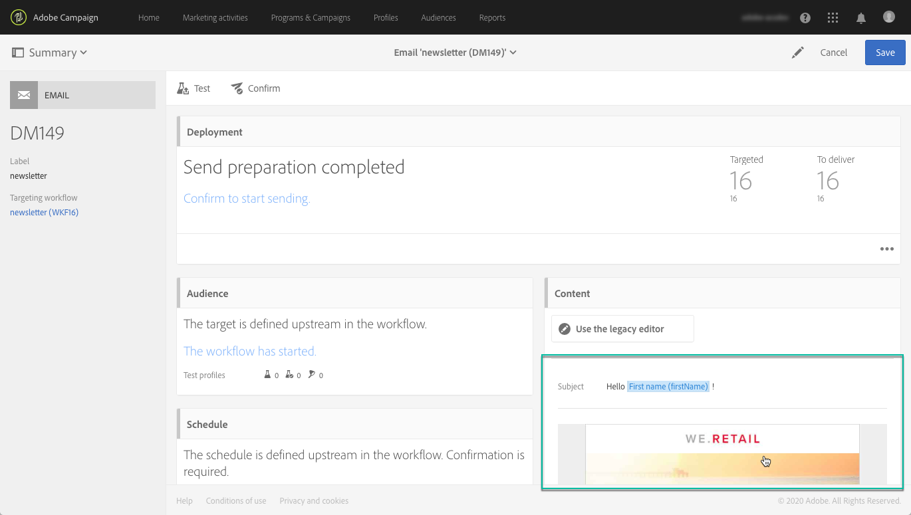

# Verifica dei messaggi e-mail tramite profili di destinazione {#testing-message-profiles}

## Panoramica {#overview}

Inoltre, per [testare i profili](../../audiences/using/managing-test-profiles.md), potete testare un messaggio e-mail inserendovi nella posizione di uno dei profili di destinazione. Questo consente di ottenere una rappresentazione esatta del messaggio che il profilo riceverà (campi personalizzati, informazioni dinamiche e personalizzate, inclusi dati aggiuntivi dai flussi di lavoro...).

>[!NOTE]
>
> Questa funzione è disponibile solo per i messaggi e-mail.

Le fasi principali sono le seguenti:

1. Configura il messaggio e avvia la fase di **preparazione** .
1. **Selezionate uno o più profili** tra quelli interessati dal messaggio.
1. Associate a ciascun profilo un indirizzo **di** sostituzione al quale verranno inviate le prove di validità.
1. (Facoltativo) Per ciascun profilo, definire un **prefisso** da aggiungere alla riga dell’oggetto della prova.
1. **Visualizzare l&#39;anteprima** del messaggio per i profili in Designer e-mail.
1. Invia le prove.

Per ulteriori informazioni sul processo globale, consulta l’esercitazione video disponibile [qui](https://docs.adobe.com/content/help/it-IT/campaign-standard-learn/tutorials/communication-channels/email/profile-substitution.html).

>[!IMPORTANT]
>
>Questa funzione ti consente di inviare le informazioni personali del profilo agli indirizzi e-mail esterni. L’esecuzione di richieste di privacy (GDPR e CCPA) all’interno di Campaign Standard NON eseguirà la richiesta esternamente.

## Selezione di profili e indirizzi di sostituzione {#selecting-profiles}

Per utilizzare i profili di destinazione per il test, è innanzitutto necessario selezionarli, quindi definire gli indirizzi di sostituzione che riceveranno le prove. A questo scopo, potete [selezionare profili](#selecting-individual-profiles) specifici tra i profili di destinazione oppure [importare profili da un&#39;audience](#importing-from-audience)esistente.

>[!NOTE]
>
>Potete selezionare un massimo di 100 profili da sottoporre a test.

### Selezione di singoli profili {#selecting-individual-profiles}

1. Nel dashboard dei messaggi, accertati che la preparazione dei messaggi abbia esito positivo, quindi fai clic sul **[!UICONTROL Audience]** blocco.

   

1. Nella **[!UICONTROL Profile substitutions]** scheda, fate clic sul **[!UICONTROL Create element]** pulsante per selezionare i profili da utilizzare per la verifica.

   

1. Fai clic sul pulsante di selezione del profilo per visualizzare l&#39;elenco dei profili di destinazione del messaggio.

   

1. Selezionare il profilo da utilizzare per il test, quindi immettere nel **[!UICONTROL Address]** campo l&#39;indirizzo di sostituzione desiderato, quindi fare clic su **[!UICONTROL Confirm]**. Tutte le prove di targeting del profilo verranno inviate a questo indirizzo e-mail, anziché a quello definito nel database per questo profilo.

   Se si desidera aggiungere un prefisso specifico alla riga dell&#39;oggetto delle prove, compilare il **[!UICONTROL Subject line prefix]** campo.

   >[!NOTE]
   >
   >Il prefisso della riga dell&#39;oggetto può contenere fino a 500 caratteri.

   

   Il prefisso verrà visualizzato come segue:

   

1. Il profilo viene aggiunto all’elenco, con l’indirizzo e il prefisso di sostituzione associati. Ripetere i passaggi indicati sopra per tutti i profili che si desidera utilizzare per il test, quindi fare clic su **[!UICONTROL Confirm]**.

   

   Se si desidera inviare una prova a più indirizzi di sostituzione per uno stesso profilo, è necessario aggiungere questo profilo il numero di volte necessario.

   Nell&#39;esempio seguente, la prova basata sul profilo John Smith verrà inviata a due indirizzi di sostituzione diversi:

   

1. Una volta definiti tutti i profili e gli indirizzi di sostituzione, puoi inviare una prova per verificare il messaggio. A questo scopo, fare clic sul **[!UICONTROL Test]** pulsante, quindi selezionare il tipo di test da eseguire.

   Se non è stato aggiunto alcun profilo di test alla destinazione del messaggio, le **[!UICONTROL Email rendering]** opzioni e **[!UICONTROL Proof + Email rendering]** non sono disponibili.  For more information on proofs sending, refer to [this section](../../sending/using/sending-proofs.md).

   

>[!IMPORTANT]
>
>Se apporti modifiche al messaggio, assicurati di avviare nuovamente la preparazione dei messaggi. In caso contrario, le modifiche non verranno riportate nella prova.

### Importazione di profili da un&#39;audience {#importing-from-audience}

Campaign Standard consente di importare un&#39;audience di profili che potete utilizzare per il test. Questo consente, ad esempio, di inviare a un indirizzo e-mail univoco un intero set di messaggi per i diversi profili.

Inoltre, se il pubblico è già configurato con le colonne di indirizzi e prefisso, sarà possibile importare queste informazioni nella **[!UICONTROL Profile substitutions]** scheda. Un esempio di importazione di audience con indirizzi di sostituzione è descritto in [questa sezione](#use-case).

>[!NOTE]
>
>Quando importate un&#39;audience, solo i profili corrispondenti alla destinazione del messaggio vengono selezionati e aggiunti alla **[!UICONTROL Profile substitutions]** scheda.

Per importare profili da utilizzare per il test da un&#39;audience, attenetevi alla seguente procedura:

1. Nel dashboard dei messaggi, accertati che la preparazione dei messaggi abbia avuto esito positivo, quindi fai clic sul **[!UICONTROL Audience]** blocco.

   

1. Nella scheda **[!UICONTROL Profile substitutions]**, fai clic su **[!UICONTROL Import from an audience]**.

   

1. Selezionate il pubblico da utilizzare, quindi immettete l&#39;indirizzo di sostituzione e il prefisso da utilizzare per le prove di stampa inviate al pubblico.

   >[!NOTE]
   >
   >Il prefisso della riga dell&#39;oggetto può contenere fino a 500 caratteri.

   

   Se gli indirizzi di sostituzione e/o i prefissi da utilizzare sono già stati definiti nel pubblico, selezionate l&#39; **[!UICONTROL From Audience]** opzione, quindi specificate la colonna da utilizzare per recuperare tali informazioni.

   

1. Fai clic sul pulsante **[!UICONTROL Import]**. I profili dell&#39;audience corrispondente alla destinazione del messaggio vengono aggiunti alla **[!UICONTROL Profile substitution]** scheda, nonché gli indirizzi e i prefissi di sostituzione associati.

>[!NOTE]
>
>Se importi nuovamente la stessa audience, con indirizzi e/o prefissi di sostituzione diversi, i profili verranno aggiunti all&#39;elenco oltre a quelli dell&#39;importazione precedente.

## Anteprima del messaggio con i profili di destinazione

>[!NOTE]
>
>Anteprima è disponibile solo con e-mail Designer.

Per visualizzare l&#39;anteprima dei messaggi utilizzando i profili di destinazione, accertati di aver aggiunto questi profili all&#39; **[!UICONTROL Profile substitution]** elenco (vedi [Definizione di profili e indirizzi](#selecting-profiles)di sostituzione).

Se desideri usare i campi di personalizzazione nel messaggio, devi aggiungerli **prima** di avviare la preparazione dei messaggi. In caso contrario, non verranno presi in considerazione nell&#39;anteprima. Di conseguenza, se apporti modifiche ai campi di personalizzazione, assicurati di avviare di nuovo la preparazione dei messaggi.

Per visualizzare in anteprima i messaggi mediante la sostituzione del profilo, procedere come segue:

1. Nel dashboard dei messaggi, fare clic sullo snapshot del contenuto per aprire il messaggio in Designer e-mail.

   

1. Select the **[!UICONTROL Preview]** tab, then click **[!UICONTROL Change profile]**.

   

1. Fare clic sulla **[!UICONTROL Profile Substitution]** scheda per visualizzare i profili di sostituzione aggiunti per il test.

   Selezionate i profili da usare per l’anteprima, quindi fate clic su **[!UICONTROL Select]**.

   

1. Viene visualizzata un&#39;anteprima del messaggio. Utilizzate le frecce per spostarsi tra i profili selezionati.

   

## Caso d’uso {#use-case}

In questo caso d’uso, desideriamo inviare a un set di profili specifici una newsletter e-mail personalizzata. Prima di inviare la newsletter, desideriamo visualizzarla in anteprima utilizzando alcuni dei profili di destinazione e inviare le prove agli indirizzi e-mail interni definiti in un file esterno.

I passaggi principali per questo caso di utilizzo sono i seguenti:

1. Create l&#39;audience da utilizzare per il test.
1. Create un flusso di lavoro per i profili di destinazione e inviate la newsletter.
1. Configura le sostituzioni del profilo del messaggio.
1. Visualizzate il messaggio in anteprima utilizzando i profili di destinazione.
1. Invia bozze.

### Passaggio 1: Creare l&#39;audience da utilizzare per il test

1. Preparare il file da importare per creare l&#39;audience. Nel nostro caso, dovrebbe contenere l&#39;indirizzo di sostituzione da utilizzare per la prova, e un prefisso da aggiungere alla riga oggetto della prova.

   In questo esempio, l&#39;indirizzo e-mail &quot;oliver.vaughan@internal.com&quot; riceverà una prova del messaggio di targeting del profilo con l&#39;indirizzo e-mail &quot;john.doe@mail.com&quot;. Il prefisso &quot;JD&quot; verrà aggiunto alla riga dell&#39;oggetto della prova.

   

1. Create il flusso di lavoro per creare un&#39;audience dal file. A questo scopo, aggiungete e configurate le attività seguenti:

   * **[!UICONTROL Load file]** activity: Importa il file CSV (per ulteriori informazioni su questa attività, consultate [questa sezione](../../automating/using/load-file.md)).
   * **[!UICONTROL Reconciliation]** activity: Collega le informazioni del file a quelle del database. In questo esempio, utilizzeremo l&#39;indirizzo e-mail del profilo come campo di riconciliazione (per ulteriori informazioni su questa attività, consulta [questa sezione](../../automating/using/reconciliation.md)).
   * **[!UICONTROL Save audience]** activity: Crea un&#39;audience basata sul file importato (per ulteriori informazioni su questa attività, consulta [questa sezione](../../automating/using/save-audience.md)).

   

1. Eseguite il flusso di lavoro, quindi andate alla **[!UICONTROL Audiences]** scheda per verificare che l&#39;audience sia stata creata con le informazioni desiderate.

   In questo esempio, l&#39;audience è composta da tre profili. Ciascuno di essi è collegato a un indirizzo e-mail sostitutivo che riceverà la prova, con un prefisso da utilizzare nella riga dell&#39;oggetto della prova.

   

### Passaggio 2: Creare un flusso di lavoro per definire i profili di destinazione e inviare la newsletter

1. Aggiungete **[!UICONTROL Query]** e **[!UICONTROL Email delivery]** configurate le attività in base alle vostre esigenze (consultate le sezioni [Query](../../automating/using/query.md) e Distribuzione [tramite](../../automating/using/email-delivery.md) e-mail).

   

1. Eseguite il flusso di lavoro e assicuratevi che la preparazione dei messaggi abbia esito positivo.

### Passaggio 3: Configurare la scheda Sostituzione profilo del messaggio

1. Aprite l&#39; **[!UICONTROL Email delivery]** attività. In the message dashboard, click the **[!UICONTROL Audience]** block.

   

1. Select the **[!UICONTROL Profile substitutions]** tab, then click **[!UICONTROL Import from an audience]**.

   

1. Nel **[!UICONTROL Audience]** campo, selezionate l&#39;audience creata dal file.

   

1. Definire l&#39;indirizzo di sostituzione e il prefisso dell&#39;oggetto da utilizzare per l&#39;invio delle prove.

   A questo scopo, selezionate l&#39; **[!UICONTROL From audience]** opzione, quindi selezionate la colonna dal pubblico che contiene le informazioni.

   

1. Fai clic sul pulsante **[!UICONTROL Import]**. I profili dell&#39;audience vengono aggiunti all&#39;elenco, con i relativi indirizzi di sostituzione e prefissi dell&#39;oggetto.

   

   >[!NOTE]
   >
   >Nel nostro caso, tutti i profili dell&#39;audience sono presi di mira dall&#39; **[!UICONTROL Query]** attività. Se uno di questi profili non faceva parte della destinazione del messaggio, non verrebbe aggiunto all&#39;elenco.

### Passaggio 4: Visualizzare l&#39;anteprima del messaggio utilizzando i profili di destinazione

1. Nel dashboard dei messaggi, fare clic sullo snapshot del contenuto per aprire il messaggio in Designer e-mail.

   

1. Select the **[!UICONTROL Preview]** tab, then click **[!UICONTROL Change profile]**.

   

1. Fare clic sulla **[!UICONTROL Profile Substitution]** scheda per visualizzare i profili di sostituzione aggiunti in precedenza.

   Selezionate i profili da usare per l’anteprima, quindi fate clic su **[!UICONTROL Select]**.

   

1. Viene visualizzata un&#39;anteprima del messaggio. Utilizzate le frecce per spostarsi tra i profili selezionati.

   

### Passaggio 5: Inviare prove

1. In the message dashboard, click the **[!UICONTROL Test]** button, then confirm.

   

1. Le prove vengono inviate in base a quanto configurato nella **[!UICONTROL Profile substitutions]** scheda.

   
