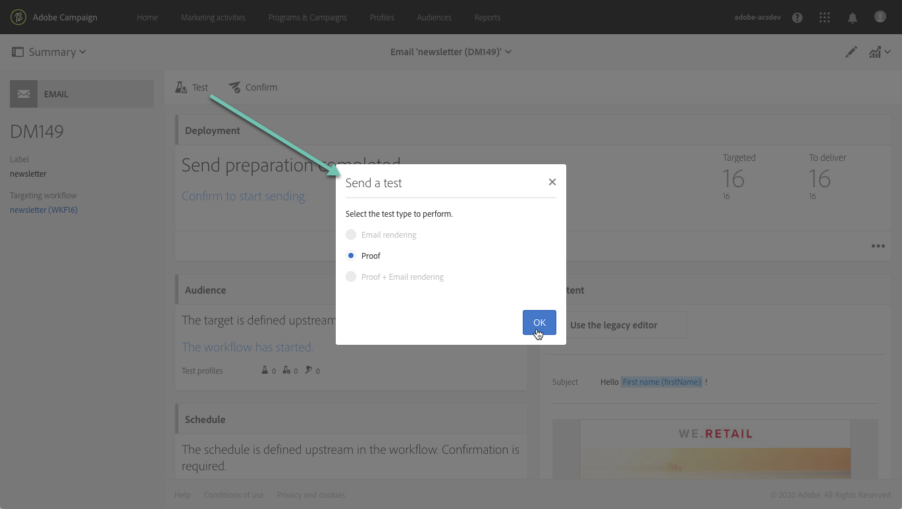

# Verifica dei messaggi e-mail tramite profili di destinazione {#testing-message-profiles}

## Panoramica {#overview}

Inoltre, per [verificare i profili](../../audiences/using/managing-test-profiles.md), puoi testare un messaggio e-mail posizionandoti nella posizione di uno dei profili target. Questo ti consente di ottenere una rappresentazione esatta del messaggio che il profilo riceverà (campi personalizzati, informazioni dinamiche e personalizzate, inclusi dati aggiuntivi dei flussi di lavoro...).

>[!NOTE]
>
> Questa funzione è disponibile solo per i messaggi e-mail.

Le fasi principali sono le seguenti:

1. Configura il messaggio e avvia la fase **Preparazione**.
1. **Seleziona uno o più** profili tra i profili target del messaggio.
1. Associa a ogni profilo un **indirizzo di sostituzione** al quale verranno inviate le bozze.
1. (Facoltativo) Per ogni profilo, definisci un **prefisso** da aggiungere alla riga dell’oggetto della bozza.
1. **** Anteprima in E-mail designer della visualizzazione del messaggio per i profili.
1. Invia le bozze.

>[!IMPORTANT]
>
>Questa funzione ti consente di inviare le informazioni personali del profilo agli indirizzi e-mail esterni. L’esecuzione di richieste di privacy (GDPR e CCPA) all’interno di Campaign Standard NON eseguirà la richiesta esternamente.

 [Scopri questa funzione nel video](#video)

## Selezione di profili e indirizzi di sostituzione {#selecting-profiles}

Per utilizzare i profili di destinazione per i test, devi prima selezionarli, quindi definire gli indirizzi di sostituzione che riceveranno le bozze. A questo scopo, puoi [selezionare profili specifici](#selecting-individual-profiles) tra i profili di destinazione oppure [importare profili da un pubblico esistente](#importing-from-audience).

>[!NOTE]
>
>Puoi selezionare un massimo di 100 profili da testare.

### Selezione di singoli profili {#selecting-individual-profiles}

1. Nel dashboard dei messaggi, accertati che la preparazione dei messaggi abbia esito positivo, quindi fai clic sul blocco **[!UICONTROL Audience]** .

   

1. Nella scheda **[!UICONTROL Profile substitutions]** , fai clic sul pulsante **[!UICONTROL Create element]** per selezionare i profili da utilizzare per i test.

   

1. Fai clic sul pulsante di selezione del profilo per visualizzare l’elenco dei profili interessati dal messaggio.

   

1. Seleziona il profilo da utilizzare per il test, quindi immetti nel campo **[!UICONTROL Address]** l’indirizzo di sostituzione desiderato, quindi fai clic su **[!UICONTROL Confirm]**. Tutte le bozze che eseguono il targeting del profilo vengono inviate a questo indirizzo e-mail, anziché a quello definito nel database per questo profilo.

   Se desideri aggiungere un prefisso specifico alla riga dell’oggetto delle bozze, compila il campo **[!UICONTROL Subject line prefix]** .

   >[!NOTE]
   >
   >Il prefisso della riga dell’oggetto può contenere fino a 500 caratteri.

   

   Il prefisso viene visualizzato come segue:

   

1. Il profilo viene aggiunto all’elenco, con l’indirizzo di sostituzione e il prefisso associati. Ripeti i passaggi precedenti per tutti i profili che desideri utilizzare per i test, quindi fai clic su **[!UICONTROL Confirm]**.

   

   Se desideri inviare una bozza a più indirizzi di sostituzione per uno stesso profilo, devi aggiungere questo profilo il numero di volte necessario.

   Nell’esempio seguente, la prova basata sul profilo John Smith verrà inviata a due indirizzi di sostituzione diversi:

   

1. Una volta definiti tutti i profili e gli indirizzi di sostituzione, puoi inviare una bozza per testare il messaggio. A questo scopo, fai clic sul pulsante **[!UICONTROL Test]** , quindi seleziona il tipo di test da eseguire.

   Se non è stato aggiunto alcun profilo di test al target del messaggio, le opzioni **[!UICONTROL Email rendering]** e **[!UICONTROL Proof + Email rendering]** non sono disponibili.  Per ulteriori informazioni sull&#39;invio delle bozze, consulta [questa sezione](../../sending/using/sending-proofs.md).

   

>[!IMPORTANT]
>
>Se apporti modifiche al messaggio, assicurati di avviare nuovamente la preparazione del messaggio. In caso contrario, le modifiche non verranno riportate nella bozza.

### Importazione di profili da un pubblico {#importing-from-audience}

Campaign Standard consente di importare un pubblico di profili da utilizzare per i test. Questo consente, ad esempio, di inviare a un indirizzo e-mail univoco un intero set di messaggi destinati a profili diversi.

Inoltre, se il pubblico è già configurato con le colonne indirizzo e prefisso , sarà possibile importare queste informazioni nella scheda **[!UICONTROL Profile substitutions]** . Un esempio di importazione di tipi di pubblico con indirizzi di sostituzione è descritto in [questa sezione](#use-case).

>[!NOTE]
>
>Durante l’importazione di un pubblico, solo i profili corrispondenti al target del messaggio vengono selezionati e aggiunti alla scheda **[!UICONTROL Profile substitutions]** .

Per importare profili da utilizzare per i test da un pubblico, effettua le seguenti operazioni:

1. Nel dashboard dei messaggi, accertati che la preparazione dei messaggi sia stata completata, quindi fai clic sul blocco **[!UICONTROL Audience]** .

   

1. Nella scheda **[!UICONTROL Profile substitutions]**, fai clic su **[!UICONTROL Import from an audience]**.

   

1. Seleziona il pubblico da utilizzare, quindi immetti l’indirizzo di sostituzione e il prefisso da utilizzare per le bozze inviate al pubblico.

   >[!NOTE]
   >
   >Il prefisso della riga dell’oggetto può contenere fino a 500 caratteri.

   

   Se gli indirizzi e/o i prefissi da utilizzare sono già stati definiti nel pubblico, seleziona l’opzione **[!UICONTROL From Audience]** , quindi specifica la colonna da utilizzare per recuperare queste informazioni.

   

1. Fai clic sul pulsante **[!UICONTROL Import]**. I profili dal pubblico corrispondente al target del messaggio vengono aggiunti alla scheda **[!UICONTROL Profile substitution]** , nonché gli indirizzi di sostituzione e i prefissi associati.

>[!NOTE]
>
>Se importi nuovamente lo stesso pubblico con indirizzi e/o prefissi di sostituzione diversi, i profili verranno aggiunti all’elenco in aggiunta a quelli dell’importazione precedente.

## Anteprima del messaggio con profili di destinazione

>[!NOTE]
>
>L’anteprima è disponibile solo con E-mail Designer.

Per visualizzare in anteprima i messaggi utilizzando i profili di destinazione, accertati di aver aggiunto questi profili all’elenco **[!UICONTROL Profile substitution]** (consulta [Definizione di profili e indirizzi di sostituzione](#selecting-profiles)).

Se desideri utilizzare i campi di personalizzazione nel messaggio, devi aggiungerli **prima di** di avviare la preparazione dei messaggi. In caso contrario, non verranno presi in considerazione nell’anteprima. Di conseguenza, assicurati di avviare nuovamente la preparazione dei messaggi in caso di modifiche apportate ai campi di personalizzazione.

Per visualizzare in anteprima i messaggi utilizzando la sostituzione del profilo, procedi come segue:

1. Nel dashboard messaggi, fai clic sullo snapshot del contenuto per aprire il messaggio in E-mail Designer.

   

1. Seleziona la scheda **[!UICONTROL Preview]** , quindi fai clic su **[!UICONTROL Change profile]**.

   

1. Fai clic sulla scheda **[!UICONTROL Profile Substitution]** per visualizzare i profili di sostituzione aggiunti per il test.

   Seleziona i profili da utilizzare per l’anteprima, quindi fai clic su **[!UICONTROL Select]**.

   

1. Viene visualizzata un’anteprima del messaggio. Utilizza le frecce per navigare tra i profili selezionati.

   

## Caso d’uso {#use-case}

In questo caso d’uso, desideriamo inviare a un set di profili specifici una newsletter e-mail personalizzata. Prima di inviare la newsletter, vogliamo visualizzarla in anteprima utilizzando alcuni dei profili di destinazione e inviare bozze agli indirizzi e-mail interni definiti in un file esterno.

I passaggi principali per questo caso d’uso sono i seguenti:

1. Crea il pubblico da utilizzare per i test.
1. Crea un flusso di lavoro per eseguire il targeting dei profili e invia la newsletter.
1. Configura le sostituzioni dei profili del messaggio.
1. Visualizza l’anteprima del messaggio utilizzando i profili di destinazione.
1. Invia bozze.

### Passaggio 1: Creare il pubblico da utilizzare per i test

1. Prepara il file da importare per creare il pubblico. Nel nostro caso, deve contenere l’indirizzo di sostituzione da utilizzare per la bozza e un prefisso da aggiungere alla riga dell’oggetto della bozza.

   In questo esempio, l’indirizzo e-mail &quot;oliver.vaughan@internal.com&quot; riceverà una prova del messaggio che esegue il targeting del profilo con l’indirizzo e-mail &quot;john.doe@mail.com&quot;. Il prefisso &quot;JD&quot; verrà aggiunto alla riga dell’oggetto della bozza.

   

1. Crea il flusso di lavoro per creare un pubblico dal file . A questo scopo, aggiungi e configura le attività seguenti:

   * **[!UICONTROL Load file]** attività: Importa il file CSV (per ulteriori informazioni su questa attività, consulta  [questa sezione](../../automating/using/load-file.md)).
   * **[!UICONTROL Reconciliation]** attività: Collega le informazioni dal file alle informazioni dal database. In questo esempio, utilizzeremo l’indirizzo e-mail del profilo come campo di riconciliazione (per ulteriori informazioni su questa attività, consulta [questa sezione](../../automating/using/reconciliation.md)).
   * **[!UICONTROL Save audience]** attività: Crea un pubblico in base al file importato (per ulteriori informazioni su questa attività, consulta  [questa sezione](../../automating/using/save-audience.md)).

   

1. Esegui il flusso di lavoro, quindi vai alla scheda **[!UICONTROL Audiences]** per verificare che il pubblico sia stato creato con le informazioni desiderate.

   In questo esempio, il pubblico è composto da tre profili. Ognuno di essi è collegato a un indirizzo e-mail di sostituzione che riceverà la bozza, con un prefisso da utilizzare nella riga dell’oggetto della bozza.

   

### Passaggio 2: Creare un flusso di lavoro per eseguire il targeting dei profili e inviare la newsletter

1. Aggiungi le attività **[!UICONTROL Query]** e **[!UICONTROL Email delivery]**, quindi configurale in base alle tue esigenze (consulta le sezioni [Query](../../automating/using/query.md) e [Email delivery](../../automating/using/email-delivery.md) ).

   

1. Esegui il flusso di lavoro e assicurati che la preparazione dei messaggi abbia esito positivo.

### Passaggio 3: Configura la scheda Sostituzione profilo del messaggio

1. Apri l’attività **[!UICONTROL Email delivery]** . Nel dashboard dei messaggi, fai clic sul blocco **[!UICONTROL Audience]** .

   

1. Seleziona la scheda **[!UICONTROL Profile substitutions]** , quindi fai clic su **[!UICONTROL Import from an audience]**.

   

1. Nel campo **[!UICONTROL Audience]** , seleziona il pubblico creato dal file .

   

1. Definisci l’indirizzo di sostituzione e il prefisso della riga dell’oggetto da utilizzare per l’invio delle bozze.

   A questo scopo, seleziona l’opzione **[!UICONTROL From audience]** , quindi seleziona la colonna dal pubblico che contiene le informazioni.

   

1. Fai clic sul pulsante **[!UICONTROL Import]**. I profili dal pubblico vengono aggiunti all’elenco, con i relativi indirizzi di sostituzione e prefissi dell’oggetto associati.

   

   >[!NOTE]
   >
   >Nel nostro caso, tutti i profili dal pubblico sono oggetto di targeting da parte dell’ attività **[!UICONTROL Query]** . Se uno di questi profili non faceva parte del target del messaggio, non verrebbe aggiunto all’elenco.

### Passaggio 4: Visualizzare in anteprima il messaggio utilizzando i profili di destinazione

1. Nel dashboard messaggi, fai clic sullo snapshot del contenuto per aprire il messaggio in E-mail Designer.

   

1. Seleziona la scheda **[!UICONTROL Preview]** , quindi fai clic su **[!UICONTROL Change profile]**.

   

1. Fai clic sulla scheda **[!UICONTROL Profile Substitution]** per visualizzare i profili di sostituzione aggiunti in precedenza.

   Seleziona i profili da utilizzare per l’anteprima, quindi fai clic su **[!UICONTROL Select]**.

   

1. Viene visualizzata un’anteprima del messaggio. Utilizza le frecce per navigare tra i profili selezionati.

   

### Passaggio 5: Invia bozze

1. Nel dashboard dei messaggi, fai clic sul pulsante **[!UICONTROL Test]** , quindi conferma.

   

1. Le bozze vengono inviate in base a ciò che è stato configurato nella scheda **[!UICONTROL Profile substitutions]** .

   

## Video tutorial {#video}

Questo video mostra come verificare i messaggi e-mail utilizzando la sostituzione Profilo.

>[!VIDEO](https://video.tv.adobe.com/v/32368?quality=12)

Sono disponibili ulteriori video dimostrativi su Campaign Standard [qui](https://experienceleague.adobe.com/docs/campaign-standard-learn/tutorials/overview.html?lang=it).
