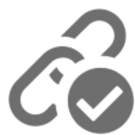

# Tracciamento dei messaggi{#tracking-messages}

## About tracking {#about-tracking}

Grazie alle funzionalità di tracciamento,  Adobe Campaign consente di monitorare il comportamento dei destinatari della consegna. A tal fine, Adobe Campaign utilizza cookie di sessione e cookie permanenti.

Potete informare gli utenti che i vostri siti sono dotati di strumenti di monitoraggio Web tramite una richiesta di autorizzazione (che viene visualizzata sopra la pagina, ad esempio) con una casella di controllo per autorizzare l’uso dei cookie, o aggiungere un banner nella parte superiore della prima pagina in cui accedono, ecc. Le finestre pop-up dovrebbero essere evitate in quanto spesso sono bloccate dai browser.

Sono disponibili informazioni di tracciamento per ogni contatto del database in **[!UICONTROL integrated customer profiles]**. Per ulteriori informazioni al riguardo, consulta [questa sezione](../../audiences/using/integrated-customer-profile.md).

 Adobe Campaign utilizza due tipi di cookie:

* Un cookie di sessione (nlid). Contiene l’identificatore dell’e-mail inviata al contatto (BroadlogId) e l’identificatore del modello di messaggio (deliveryId). Viene aggiunto quando il contatto fa clic su un URL incluso in un’e-mail inviata da Adobe Campaign e ti consente di tracciarne il comportamento sul web. Questo cookie di sessione viene cancellato automaticamente alla chiusura del browser. Il contatto può configurare il browser per rifiutare i cookie.
* Un cookie condiviso tra le soluzioni Adobe Experience Cloud. Questo consente di identificare gli utenti che interagiscono con le soluzioni del Experience Cloud  quando visitano un sito Web. La descrizione di questo cookie è disponibile [qui](https://docs.adobe.com/content/help/en/core-services/interface/ec-cookies/cookies-mc.html).

Il tracciamento con l’Adobe Campaign Standard  consente di accedere alle seguenti funzionalità:

<table>
<tr>
    <td valign="top">
        
    </td>
    <td valign="top">
        
    </td>
    <td valign="top">
        
    </td>
        <td valign="top">
          
    </td>
    </td>
    <td valign="top">
          
</tr>
<tr>
<td>Tracciamento e-mail</td>
<td>Tracciamento push</td>
<td>URL tracciati</td>
<td>Tracciamento dei registri</td>
<td>Tracciamento del rapporto</td>
</tr>
</table>

## Tracking logs {#tracking-logs}

La **[!UICONTROL Tracking logs]** scheda elenca la cronologia di tracciamento per la consegna. In questa scheda vengono visualizzate le informazioni di tracciamento dei messaggi inviati, ad esempio tutti gli URL tracciati da  Adobe Campaign. Le informazioni di tracciamento in questa scheda vengono aggiornate ogni 10 minuti.

>[!NOTE]
>
>Se il tracciamento non è abilitato per una consegna, questa scheda non viene visualizzata. I registri di tracciamento sono disponibili solo per i canali di **e-mail** e di notifica **** push.

Nell&#39;esempio precedente, il destinatario:

* Apertura del messaggio.
* Fate clic sul collegamento personalizzato &quot;LEARN MORE&quot;.
* Fare clic sul collegamento della pagina mirror e dell&#39;annullamento dell&#39;iscrizione.

Nella **[!UICONTROL Type]** colonna, i valori possibili sono:

* **[!UICONTROL Email click]**: i destinatari hanno fatto clic su un collegamento personalizzato.
* **[!UICONTROL Mirror page]**: il destinatario ha fatto clic su un collegamento alla pagina mirror.
* **[!UICONTROL Open]**: il destinatario ha aperto il messaggio e-mail.
* **[!UICONTROL Opt-out]**: il destinatario ha fatto clic su un collegamento di annullamento dell&#39;iscrizione.

>[!NOTE]
>
>Per il canale di notifica **** push, vengono tracciati solo i clic sulle notifiche per dispositivi mobili. In tal caso, il valore sarà **[!UICONTROL Click on mobile notification]**.

Per ulteriori informazioni su come inserire i collegamenti di tracciamento, consulta [questa pagina](../../designing/using/links.md#inserting-a-link).

## URL tracciati {#tracked-urls}

La **[!UICONTROL Tracked URLs]** scheda raggruppa gli URL contenuti nel messaggio inviato, incluso il tipo di URL e l&#39;URL di origine.

For more on tracking links, refer to [this section](../../designing/using/links.md#about-tracked-urls).
