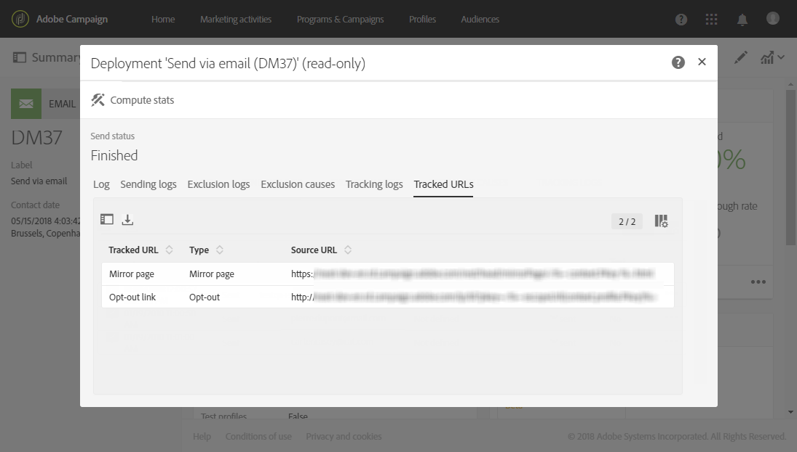

# Tracciamento dei messaggi{#tracking-messages}

## Informazioni sul tracciamento {#about-tracking}

Grazie alle sue funzionalità di tracciamento, Adobe Campaign ti consente di monitorare il comportamento dei destinatari della consegna. A tal fine, Adobe Campaign utilizza cookie di sessione e cookie permanenti.

Puoi informare gli utenti che i tuoi siti sono dotati di strumenti di tracciamento web tramite una richiesta di autorizzazione (che viene visualizzata sopra la pagina, ad esempio) con una casella di controllo per autorizzare l’uso dei cookie, oppure puoi aggiungere un banner nella parte superiore della prima pagina a cui accedono, ecc. Le finestre pop-up dovrebbero essere evitate in quanto spesso sono bloccate dai browser.

Le informazioni di rilevamento sono disponibili per ogni contatto del database in **[!UICONTROL integrated customer profiles]**. Per ulteriori informazioni al riguardo, consulta [questa sezione](../../audiences/using/integrated-customer-profile.md).

 Adobe Campaign utilizza due tipi di cookie:

* Un cookie di sessione (nlid). Contiene l’identificatore dell’e-mail inviata al contatto (broadlogId) e l’identificatore del modello del messaggio (deliveryId). Viene aggiunto quando il contatto fa clic su un URL incluso in un’e-mail inviata da Adobe Campaign e ti consente di tracciarne il comportamento sul web. Questo cookie di sessione viene cancellato automaticamente alla chiusura del browser. Il contatto può configurare il browser per rifiutare i cookie.
* Cookie condiviso tra soluzioni Adobe Experience Cloud. Questo consente di identificare gli utenti che interagiscono con le soluzioni di Experience Cloud quando visitano un sito web. La descrizione di questo cookie è disponibile [qui](https://experienceleague.adobe.com/docs/core-services/interface/ec-cookies/cookies-mc.html?lang=it).

Il tracciamento con Adobe Campaign Standard ti consente di accedere alle seguenti funzionalità:

<table>
<tr>
    <td valign="top">
        
    </td>
    <td valign="top">
        
    </td>
    <td valign="top">
        
    </td>
        <td valign="top">
          
    </td>
    </td>
    <td valign="top">
          
</tr>
<tr>
<td>Tracciamento e-mail</td>
<td>Tracciamento push</td>
<td>URL tracciati</td>
<td>Registri di tracciamento</td>
<td>Rapporto di tracciamento</td>
</tr>
</table>

## Registri di tracciamento {#tracking-logs}

La scheda **[!UICONTROL Tracking logs]** elenca la cronologia di tracciamento per questa consegna. In questa scheda vengono visualizzate le informazioni di tracciamento per i messaggi inviati, ad esempio tutti gli URL tracciati da Adobe Campaign. Le informazioni di tracciamento in questa scheda vengono aggiornate ogni 10 minuti.

>[!NOTE]
>
>Se il tracciamento non è abilitato per una consegna, questa scheda non viene visualizzata. I registri di tracciamento sono disponibili solo per i canali **email** e **push notification**.

Nell’esempio precedente, il destinatario:

* Apertura del messaggio.
* Fai clic sul collegamento della pagina speculare.
* Fai clic sul collegamento personalizzato &quot;ULTERIORI INFORMAZIONI&quot;.

Nella colonna **[!UICONTROL Type]** i valori possibili sono:

* **[!UICONTROL Email click]**: i destinatari hanno fatto clic su un collegamento personalizzato.
* **[!UICONTROL Mirror page]**: il destinatario ha fatto clic su un collegamento alla pagina mirror.
* **[!UICONTROL Open]**: il destinatario ha aperto l&#39;e-mail.
* **[!UICONTROL Opt-out]**: il destinatario ha fatto clic su un collegamento di annullamento dell&#39;abbonamento.

>[!NOTE]
>
>Per il canale **notifica push**, vengono tracciati solo i clic sulle notifiche mobili. In tal caso, il valore sarà **[!UICONTROL Click on mobile notification]**.

Per ulteriori informazioni su come inserire collegamenti di tracciamento, consulta [questa pagina](../../designing/using/links.md#inserting-a-link).

Il report **[!UICONTROL Tracking indicators]** contiene gli indicatori chiave per il comportamento di tracciamento dopo la ricezione dei messaggi e-mail. Per ulteriori informazioni, consulta questa [pagina](../../reporting/using/tracking-indicators.md).

## URL tracciati {#tracked-urls}

La scheda **[!UICONTROL Tracked URLs]** raggruppa gli URL contenuti nel messaggio inviato, inclusi il tipo di URL e l&#39;URL di origine.

Per ulteriori informazioni sul tracciamento dei collegamenti, consulta [questa sezione](../../designing/using/links.md#about-tracked-urls).
