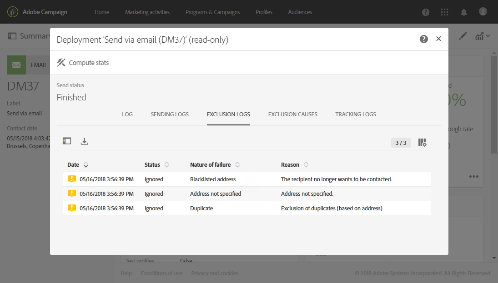

# Informazioni sugli errori di consegna{#understanding-delivery-failures}

## Informazioni sugli errori di consegna {#about-delivery-failures}

Quando una consegna non può essere inviata a un profilo, il server remoto invia automaticamente un messaggio di errore, rilevato dalla piattaforma Adobe Campaign e qualificato per determinare se l’indirizzo e-mail o il numero di telefono devono essere posti in quarantena o meno. Consulta [Qualificazione di mail non recapitate](#bounce-mail-qualification).

>[!NOTE]
>
>I messaggi di errore **E-mail** (o &quot;mancati recapiti&quot;) sono qualificati dall’MTA avanzato (mancati recapiti sincroni) o dal processo inMail (mancati recapiti asincroni).
>
>I messaggi di errore **SMS** (o &quot;SR&quot; per &quot;Report di stato&quot;) sono qualificati dal processo MTA.

I messaggi possono essere esclusi anche durante la preparazione della consegna se un indirizzo è messo in quarantena o se un profilo si trova nel inserisco nell&#39;elenco Bloccati di. I messaggi esclusi sono elencati nella scheda **[!UICONTROL Exclusion logs]** del dashboard di consegna (consulta [questa sezione](../../sending/using/monitoring-a-delivery.md#exclusion-logs)).

**Argomenti correlati:**

* [Informazioni sulla gestione della quarantena](../../sending/using/understanding-quarantine-management.md)
* [Informazioni su consenso e rinuncia in Campaign](../../audiences/using/about-opt-in-and-opt-out-in-campaign.md)
* [Rimbalzi](https://experienceleague.adobe.com/docs/deliverability-learn/deliverability-best-practice-guide/metrics-for-deliverability/bounces.html#metrics-for-deliverability)

## Identificazione degli errori di consegna per un messaggio {#identifying-delivery-failures-for-a-message}

Una volta inviata la consegna, la scheda **[!UICONTROL Sending logs]** (consulta [questa sezione](../../sending/using/monitoring-a-delivery.md#sending-logs)) ti consente di visualizzare lo stato della consegna per ciascun profilo e il tipo e il motivo dell’errore associati (consulta [Tipi e motivi di errori di consegna](#delivery-failure-types-and-reasons)).

È inoltre disponibile un report preconfigurato. Questo report descrive gli errori rigidi e morbidi riscontrati durante le consegne nonché l’elaborazione automatica dei mancati recapiti. Per ulteriori informazioni, consulta [questa sezione](../../reporting/using/bounce-summary.md).

## Tipi e motivi di errori di consegna {#delivery-failure-types-and-reasons}

Se una consegna non riesce, possono verificarsi tre tipi di errori:

* **Rigido**: un errore &quot;rigido&quot; indica un indirizzo non valido. Ciò comporta un messaggio di errore che indica esplicitamente che l’indirizzo non è valido, ad esempio: &quot;Utente sconosciuto&quot;.
* **Morbido**: potrebbe trattarsi di un errore temporaneo o di un errore che non è stato possibile classificare, ad esempio: &quot;Dominio non valido&quot; o &quot;Casella in entrata piena&quot;.
* **Ignorato**: si tratta di un errore che è noto come temporaneo, ad esempio &quot;Fuori sede&quot;, o di un errore tecnico, ad esempio se il tipo di mittente è &quot;postmaster&quot;.

I possibili motivi di un errore di consegna sono:

| Etichetta errore | Tipo di errore | Descrizione |
| ---------|----------|---------|
| **[!UICONTROL User unknown]** | Rigido | L&#39;indirizzo non esiste. Per questo profilo non verranno tentate ulteriori consegne. |
| **[!UICONTROL Quarantined address]** | Rigido | L’indirizzo è stato messo in quarantena. |
| **[!UICONTROL Unreachable]** | Morbido/rigido | Si è verificato un errore nella catena di consegna del messaggio (ad esempio, dominio temporaneamente non raggiungibile). In base all’errore restituito dal provider, l’indirizzo verrà posto direttamente in quarantena o la consegna verrà ritentata finché Campaign non riceve un errore che giustifica lo stato di quarantena o finché non vengono raggiunti 5 errori. |
| **[!UICONTROL Address empty]** | Rigido | Indirizzo non definito. |
| **[!UICONTROL Mailbox full]** | Morbido | La cassetta postale dell&#39;utente è piena e non può accettare altri messaggi. Questo indirizzo può essere rimosso dall’elenco di quarantena per effettuare un altro tentativo. Viene rimosso automaticamente dopo 30 giorni. Per consentire la rimozione automatica dell’indirizzo dall’elenco degli indirizzi in quarantena, è necessario avviare il flusso di lavoro tecnico **[!UICONTROL Database cleanup]**. |
| **[!UICONTROL Refused]** | Morbido/rigido | L’indirizzo è stato messo in quarantena a causa di un feedback di sicurezza come segnalazione di spam. In base all’errore restituito dal provider, l’indirizzo verrà posto direttamente in quarantena o la consegna verrà ritentata finché Campaign non riceve un errore che giustifica lo stato di quarantena o finché non vengono raggiunti 5 errori. |
| **[!UICONTROL Duplicate]** | Ignorato | Indirizzo già rilevato nella segmentazione. |
| **[!UICONTROL Not defined]** | Morbido | l’indirizzo è in qualificazione perché gli errori non sono stati incrementati. | ancora. Questo tipo di errore si verifica quando un nuovo messaggio di errore viene inviato dal server: può essere un errore isolato, ma se si verifica di nuovo, il contatore degli errori aumenta, avvisando i team tecnici. |
| **[!UICONTROL Error ignored]** | Ignorato | L’indirizzo è in inserita nell&#39;elenco Consentiti di accesso e un messaggio e-mail vi verrà inviato in ogni caso. |
| **[!UICONTROL Address on denylist]** | Rigido | L’indirizzo è stato aggiunto al inserisco nell&#39;elenco Bloccati di invio dell’. |
| **[!UICONTROL Account disabled]** | Morbido/rigido | Quando il fornitore di accesso a Internet (IAP) rileva un periodo prolungato di inattività, può chiudere l’account dell’utente: le consegne all’indirizzo dell’utente saranno quindi impossibili. Il tipo morbido o rigido dipende dal tipo di errore ricevuto: se l’account è temporaneamente disattivato a causa di sei mesi di inattività e può ancora essere attivato, verrà assegnato lo stato **[!UICONTROL Erroneous]** e la consegna verrà ritentata. Se l’errore ricevuto segnala che l’account è disattivato in modo permanente, verrà posto direttamente in quarantena. |
| **[!UICONTROL Not connected]** | Ignorato | Il telefono cellulare del profilo è spento o non è connesso alla rete quando il messaggio viene inviato. |
| **[!UICONTROL Invalid domain]** | Morbido | Il dominio dell’indirizzo e-mail non è corretto o non esiste più. Questo profilo sarà nuovamente oggetto di targeting fino a raggiungere 5 errori. Successivamente, il record verrà impostato sullo stato di quarantena e non verrà eseguito alcun nuovo tentativo. |
| **[!UICONTROL Text too long]** | Ignorato | Il numero di caratteri nel messaggio SMS supera il limite. Per ulteriori informazioni, consulta [Codifica, lunghezza e traslitterazione degli SMS](../../administration/using/configuring-sms-channel.md#sms-encoding--length-and-transliteration). |
| **[!UICONTROL Character not supported by encoding]** | Ignorato | Il messaggio SMS contiene uno o più caratteri non supportati dalla codifica. &amp;Per ulteriori informazioni, consulta [Tabella dei caratteri: standard GSM](../../administration/using/configuring-sms-channel.md#table-of-characters---gsm-standard). |

**Argomenti correlati:**
* [Rimbalzi permanenti](https://experienceleague.adobe.com/docs/deliverability-learn/deliverability-best-practice-guide/metrics-for-deliverability/bounces.html#hard-bounces)
* [Mancati recapiti non permanenti](https://experienceleague.adobe.com/docs/deliverability-learn/deliverability-best-practice-guide/metrics-for-deliverability/bounces.html#soft-bounces)

## Tentativi dopo un errore temporaneo di consegna {#retries-after-a-delivery-temporary-failure}

Se un messaggio non riesce a causa di un errore temporaneo, verranno eseguiti nuovi tentativi per la durata della consegna. Per ulteriori informazioni sui tipi di errori, consulta [Tipi e motivi di errori di consegna](#delivery-failure-types-and-reasons).

Il numero di nuovi tentativi (numero di tentativi da eseguire il giorno successivo all’avvio dell’invio) e il ritardo minimo tra nuovi tentativi sono ora<!--managed by the Adobe Campaign Enhanced MTA,--> in base alle prestazioni sia cronologiche che attuali di un IP all’interno di un determinato dominio. Le impostazioni **Nuovi tentativi** in Campaign vengono ignorate.

<!--Please note that Adobe Campaign Enhanced MTA is not available for the Push channel.-->

Per modificare la durata di una consegna, passa ai parametri avanzati della consegna o del modello di consegna e modifica il campo **[!UICONTROL Delivery duration]** della sezione [Periodo di validità](../../administration/using/configuring-email-channel.md#validity-period-parameters).

>[!IMPORTANT]
>
>**Il parametro &#x200B;** [!UICONTROL Delivery duration]&#x200B;**nelle consegne di Campaign viene ora utilizzato soltanto se impostato su 3,5 giorni o meno.** Se definisci un valore superiore a 3,5 giorni, questo non verrà preso in considerazione.

Ad esempio, se desideri che i nuovi tentativi per una consegna si interrompano dopo un giorno, puoi impostare la durata della consegna su **1d** e i messaggi nella coda dei nuovi tentativi verranno rimossi dopo un giorno.

>[!NOTE]
>
>Una volta che un messaggio è rimasto nella coda dei tentativi per un massimo di 3,5 giorni e la consegna non è riuscita, si verificherà un timeout e il suo stato verrà aggiornato<!--from **[!UICONTROL Sent]**--> in **[!UICONTROL Failed]** nei [registri di consegna](../../sending/using/monitoring-a-delivery.md#delivery-logs).

<!--MOVED TO configuring-email-channel.md > LEGACY SETTINGS
The default configuration allows five retries at one-hour intervals, followed by one retry per day for four days. The number of retries can be changed globally (contact your Adobe technical administrator) or for each delivery or delivery template (see [this section](../../administration/using/configuring-email-channel.md#sending-parameters)).-->

## Errori sincroni e asincroni {#synchronous-and-asynchronous-errors}

Una consegna può non riuscire immediatamente (errore sincrono) oppure in seguito, dopo che è stata inviata (errore asincrono).

* **Errore sincrono**: il server remoto contattato dal server di consegna di Adobe Campaign ha restituito immediatamente un messaggio di errore. La consegna non può essere inviata al server del profilo.
* **Errore asincrono**: una mail non recapitata o un SR è stato inviato in seguito dal server ricevente. Gli errori asincroni possono verificarsi fino a una settimana dopo l’invio di una consegna.

## Qualificazione di mail non recapitate {#bounce-mail-qualification}

Per i messaggi di errore di mancata consegna sincroni, l’MTA avanzato di Adobe Campaign (Message Transfer Agent) determina il tipo di mancato recapito e la qualifica e invia nuovamente tali informazioni a Campaign.

>[!NOTE]
>
>Le qualifiche di mancato recapito nella tabella **[!UICONTROL Message qualification]** di Campaign non vengono più utilizzate.

Le mancate consegne asincrone vengono comunque qualificate dal processo inMail attraverso le regole **[!UICONTROL Inbound email]**. Per accedere a queste regole, fai clic sul logo **Adobe**, in alto a sinistra, quindi seleziona **[!UICONTROL Administration > Channels > Email > Email processing rules]** e seleziona **[!UICONTROL Bounce mails]**. Per ulteriori informazioni su questa regola, consulta [questa sezione](../../administration/using/configuring-email-channel.md#email-processing-rules).

Per ulteriori informazioni sui mancati recapiti e sui diversi tipi di mancati recapiti, consulta [questa sezione](https://experienceleague.adobe.com/docs/deliverability-learn/deliverability-best-practice-guide/metrics-for-deliverability/bounces.html#metrics-for-deliverability).

<!--MOVED TO configuring-email-channel.md > LEGACY SETTINGS

Bounces can have the following qualification statuses:

* **[!UICONTROL To qualify]**: the bounce mail needs to be qualified. Qualification must be done by the Deliverability team to ensure that the platform deliverability functions correctly. As long as it is not qualified, the bounce mail is not used to enrich the list of email processing rules.
* **[!UICONTROL Keep]**: the bounce mail was qualified and will be used by the **Update for deliverability** workflow to be compared to existing email processing rules and enrich the list.
* **[!UICONTROL Ignore]**: the bounce mail was qualified but will not be used by the **Update for deliverability** workflow. So it will not be sent to the client instances.

To list the various bounces and their associated error types et reasons, click the **Adobe** logo, in the top-left, then select **[!UICONTROL Administration > Channels > Quarantines > Message qualification]**.

-->

## Ottimizzazione della consegna delle e-mail con il doppio meccanismo di consenso {#optimizing-mail-deliverability-with-double-opt-in-mechanism}

Il doppio meccanismo di consenso è una best practice per l’invio di e-mail. Esso protegge la piattaforma da indirizzi e-mail errati o non validi, da spambot e impedisce possibili reclami di spam.

Il principio consiste nell’inviare un’e-mail per confermare il consenso del visitatore prima di memorizzarlo come &quot;profilo&quot; nel database di Campaign: il visitatore compila una pagina di destinazione online, quindi riceve un’e-mail e deve fare clic sul collegamento di conferma per finalizzare l’abbonamento.

Per ulteriori informazioni, consulta [questa sezione](../../channels/using/setting-up-a-double-opt-in-process.md).
