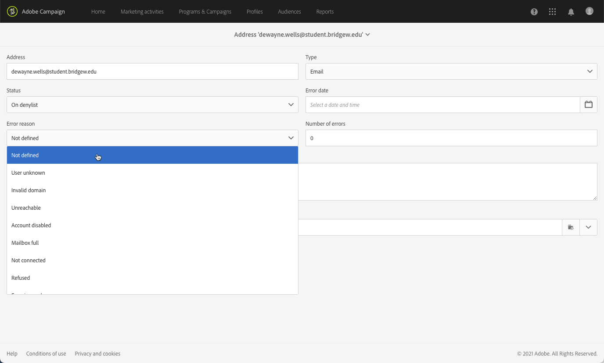
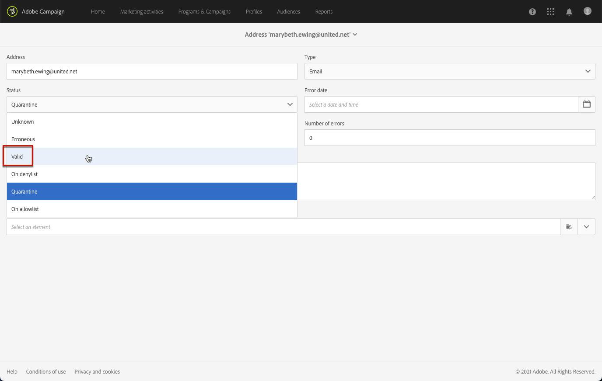

# Informazioni sulla gestione della quarantena{#understanding-quarantine-management}

## Informazioni sulla quarantena {#about-quarantines}

È possibile mettere in quarantena un indirizzo e-mail o un numero di telefono, ad esempio, quando la casella di posta è piena o se l’indirizzo non esiste.

In ogni caso, la procedura di quarantena è conforme alle regole specifiche descritte nella presente [sezione](#conditions-for-sending-an-address-to-quarantine).

### Ottimizzazione della consegna tramite quarantena {#optimizing-your-delivery-through-quarantines}

I profili con indirizzi e-mail o numeri di telefono in quarantena vengono automaticamente esclusi durante la preparazione dei messaggi (vedi [Identificazione degli indirizzi messi in quarantena per una consegna](#identifying-quarantined-addresses-for-a-delivery)). In questo modo le consegne sono più rapide, poiché il tasso di errore ha un effetto significativo sulla velocità di consegna.

Alcuni provider di accesso a Internet considerano automaticamente le e-mail come spam se il tasso di indirizzi non validi è troppo alto. La quarantena ti consente quindi di evitare di essere aggiunta al elenco Bloccati da questi provider.

Inoltre, le quarantene contribuiscono a ridurre i costi di invio degli SMS escludendo numeri di telefono errati dalle consegne.

Per ulteriori informazioni sulle best practice per proteggere e ottimizzare le consegne, consulta [questa pagina](../../sending/using/delivery-best-practices.md).

### Quarantena rispetto Elenco Bloccati {#quarantine-vs-denylist}

La quarantena e il elenco Bloccati non si applicano allo stesso oggetto:

* **Quarantena** si applica solo a un **indirizzo** (o numero di telefono, ecc.), non al profilo stesso. Ad esempio, un profilo con indirizzo e-mail messo in quarantena potrebbe aggiornare il profilo e immettere un nuovo indirizzo e potrebbe quindi essere nuovamente oggetto di targeting mediante azioni di consegna. Allo stesso modo, se due profili hanno lo stesso numero di telefono, saranno entrambi interessati se il numero viene messo in quarantena.

   Gli indirizzi o i numeri di telefono messi in quarantena vengono visualizzati nella [registri di esclusione](#identifying-quarantined-addresses-for-a-delivery) (per una consegna) o [elenco di quarantena](#identifying-quarantined-addresses-for-the-entire-platform) (per l&#39;intera piattaforma).

* Essere sul **elenco Bloccati**, d&#39;altra parte, si tradurrà in **profilo** non viene più eseguito il targeting dalla consegna, ad esempio dopo un annullamento dell’abbonamento (opt-out), per un determinato canale. Ad esempio, se un profilo nel elenco Bloccati del canale e-mail ha due indirizzi e-mail, entrambi gli indirizzi saranno esclusi dalla consegna. Per ulteriori informazioni sul processo di elenco Bloccati, consulta [Informazioni sul consenso e diniego in Campaign](../../audiences/using/about-opt-in-and-opt-out-in-campaign.md).

   Puoi verificare se un profilo è sul elenco Bloccati di uno o più canali nel **[!UICONTROL No longer contact (on denylist)]** sezione del profilo **[!UICONTROL General]** scheda . Vedi [questa sezione](../../audiences/using/managing-opt-in-and-opt-out-in-campaign.md#managing-opt-in-and-opt-out-from-a-profile).

>[!NOTE]
>
>La quarantena include un **A elenco Bloccati** , che si applica quando i destinatari segnalano il messaggio come spam o rispondono a un messaggio SMS con una parola chiave come &quot;STOP&quot;. In tal caso, l&#39;indirizzo o il numero di telefono del profilo interessato viene messo in quarantena con il **[!UICONTROL On denylist]** stato. Per ulteriori informazioni sulla gestione dei messaggi SMS STOP, consulta [questa sezione](../../channels/using/managing-incoming-sms.md#managing-stop-sms).

<!--When a user replies to an SMS message with a keyword such as STOP in order to opt-out from SMS deliveries, his profile is not added to the denylist like in the email opt-out process. Instead, the profile's phone number is sent to quarantine with the **[!UICONTROL On denylist]** status. This status refers to the phone number only, meaning that the profile will continue receiving email messages.<!-- Also, if the profile has another phone number, he can still receive SMS messages on the other number. For more on this, refer to [this section](../../channels/using/managing-incoming-sms.md#managing-stop-sms).-->

## Identificazione degli indirizzi messi in quarantena {#identifying-quarantined-addresses}

Gli indirizzi messi in quarantena possono essere visualizzati per una consegna specifica o per l’intera piattaforma.

<!--
If you need to remove an address from quarantine, contact your technical administrator.
-->

### Identificazione di indirizzi messi in quarantena per una consegna {#identifying-quarantined-addresses-for-a-delivery}

Gli indirizzi in quarantena per una consegna specifica vengono elencati durante la fase di preparazione della consegna, nella scheda **[!UICONTROL Exclusion logs]** del dashboard di consegna (vedi [questa sezione](../../sending/using/monitoring-a-delivery.md#exclusion-logs)). Per ulteriori informazioni sulla preparazione della consegna, consulta [questa sezione](../../sending/using/preparing-the-send.md).

### Identificazione degli indirizzi messi in quarantena per l’intera piattaforma {#identifying-quarantined-addresses-for-the-entire-platform}

Gli amministratori possono accedere all’elenco dettagliato degli indirizzi e-mail messi in quarantena per l’intera piattaforma dall’elenco **[!UICONTROL Administration > Channels > Quarantines > Addresses]** menu.

<!--
This menu lists quarantined elements for **Email**, **SMS** and **Push notification** channels.
-->

>[!NOTE]
>
>L’aumento del numero delle quarantene è un effetto normale, legato all’&quot;usura&quot; del database. Ad esempio, se la durata di un indirizzo e-mail è considerata di tre anni e la tabella dei destinatari aumenta del 50% ogni anno, l’aumento delle quarantene può essere calcolato come segue: Fine anno 1: 1&#42;0,33)/(1+0,5)=22%. Fine anno 2: (1.22)&#42;0,33)+0,33)/(1,5+0,75)=32,5%.

Sono disponibili filtri che consentono di sfogliare l’elenco. Puoi filtrare l’indirizzo, lo stato e/o il canale.

È possibile modificare oppure [delete](#removing-a-quarantined-address) ciascuna voce, nonché crearne di nuove.

Per modificare una voce, fai clic sulla riga corrispondente e modifica i campi in base alle esigenze.

Per aggiungere manualmente una nuova voce, utilizza la variabile **[!UICONTROL Create]** pulsante .

Definire l’indirizzo (o il numero di telefono, ecc.) e il tipo di canale. È possibile impostare uno stato per l’inserimento nell’elenco di quarantena e un motivo di errore. È inoltre possibile indicare la data in cui si è verificato l’errore, il numero di errori e immettere il testo di errore. Se necessario, seleziona l’ultima consegna inviata all’indirizzo dall’elenco a discesa.

## Rimozione di un indirizzo dalla quarantena {#removing-a-quarantined-address}

### Aggiornamenti automatici {#unquarantine-auto}

Gli indirizzi che corrispondono a condizioni specifiche vengono eliminati automaticamente dall&#39;elenco di quarantena dal flusso di lavoro Database cleanup . Ulteriori informazioni sui flussi di lavoro tecnici, vedi [questa sezione](../../administration/using/technical-workflows.md#list-of-technical-workflows).

Gli indirizzi vengono rimossi automaticamente dall’elenco di quarantena nei seguenti casi:

* Indirizzi in un **[!UICONTROL Erroneous]** lo stato viene rimosso dall’elenco di quarantena dopo la consegna riuscita.
* Indirizzi in un **[!UICONTROL Erroneous]** lo stato verrà rimosso dall’elenco di quarantena se l’ultimo messaggio non recapitato è stato eseguito più di 10 giorni fa. Per ulteriori informazioni sulla gestione degli errori software, consulta [questa sezione](#soft-error-management).
* Indirizzi in un **[!UICONTROL Erroneous]** che rimbalzano con il **[!UICONTROL Mailbox full]** L&#39;errore verrà rimosso dall&#39;elenco di quarantena dopo 30 giorni.

Il loro stato cambia in **[!UICONTROL Valid]**.

Numero massimo di tentativi da eseguire in caso di **[!UICONTROL Erroneous]** lo stato e il ritardo minimo tra i nuovi tentativi si basano ora sulle prestazioni di un IP sia storicamente che attualmente in un determinato dominio.

>[!IMPORTANT]
>
>Destinatari con un indirizzo in un **[!UICONTROL Quarantine]** o **[!UICONTROL Denylisted]** lo stato non viene mai rimosso, anche se riceve un’e-mail.

### Aggiornamenti manuali {#unquarantine-manual}

Puoi anche rimuovere manualmente la quarantena di un indirizzo.  Per rimuovere manualmente un indirizzo dall’elenco di quarantena, è possibile rimuoverlo dall’elenco di quarantena o modificarne lo stato in **[!UICONTROL Valid]**.

* Seleziona l’indirizzo dal **[!UICONTROL Administration > Channels > Quarantines > Addresses]** elenco e seleziona **[!UICONTROL Delete element]**.

   

* Seleziona un indirizzo e modificane uno **[!UICONTROL Status]** a **[!UICONTROL Valid]**.

   

### Aggiornamenti in blocco {#unquarantine-bulk}

Potrebbe essere necessario eseguire aggiornamenti in blocco sull&#39;elenco di quarantena, ad esempio in caso di interruzione dell&#39;ISP. In questo caso, le e-mail vengono contrassegnate erroneamente come messaggi non recapitati perché non possono essere recapitate correttamente al destinatario. Questi indirizzi devono essere rimossi dall’elenco di quarantena.

Per eseguire questa operazione, crea un flusso di lavoro e aggiungi un **[!UICONTROL Query]** attività nella tabella di quarantena per filtrare tutti i destinatari interessati. Una volta identificati, possono essere rimossi dall’elenco di quarantena e inclusi nelle future consegne e-mail di Campaign.

In base al calendario dell’incidente, di seguito sono riportate le linee guida consigliate per questa query.

* **Testo di errore (testo di quarantena)** contiene &quot;550-5.1.1&quot; E **Testo di errore (testo di quarantena)** contiene &quot;support.ISP.com&quot;

   dove &quot;support.ISP.com&quot; può essere: &quot;support.apple.com&quot; o &quot;support.google.com&quot; per esempio

* **Stato aggiornamento (@lastModified)** su o dopo MM/GG/AAAA HH:MM:SS AM
* **Stato aggiornamento (@lastModified)** su o prima MM/GG/AAAA HH:MM:PM SS

Dopo aver visualizzato l’elenco dei destinatari interessati, aggiungi un **[!UICONTROL Update data]** attività per impostare lo stato del proprio indirizzo e-mail su **[!UICONTROL Valid]** in modo che vengano rimosse dall&#39;elenco di quarantena **[!UICONTROL Database cleanup]** workflow. Puoi anche eliminarli dalla tabella di quarantena.

## Condizioni per la messa in quarantena di un indirizzo {#conditions-for-sending-an-address-to-quarantine}

Adobe Campaign gestisce la quarantena in base al tipo di consegna non riuscita e al motivo assegnato durante la qualifica dei messaggi di errore (consulta [Tipi di consegna non riuscita e motivi](../../sending/using/understanding-delivery-failures.md#delivery-failure-types-and-reasons) e [Qualifica delle e-mail non recapitate](../../sending/using/understanding-delivery-failures.md#bounce-mail-qualification)).

* **Errore ignorato**: gli errori ignorati non mettono un indirizzo in quarantena.
* **Errore rigido**: l’indirizzo e-mail corrispondente viene messo immediatamente in quarantena.
* **Errore morbido**: gli errori morbidi non mettono immediatamente un indirizzo in quarantena, ma incrementano un contatore di errori. Per ulteriori informazioni, consulta [Gestione degli errori software](#soft-error-management).

   <!--
  When the error counter reaches the limit threshold, the address goes into quarantine. In the default configuration, the threshold is set at five errors, where two errors are significant if they occur at least 24 hours apart. The address is placed in quarantine at the fifth error. The error counter threshold can be modified. For more on this, refer to this [page](../../administration/using/configuring-email-channel.md#email-channel-parameters).
  When a delivery is successful after a retry, the error counter of the address which was prior to that quarantined is reinitialized. The address status changes to **[!UICONTROL Valid]** and it is deleted from the list of quarantines after two days by the **[!UICONTROL Database cleanup]** workflow.
  -->

Se un utente qualifica un’e-mail come spam ([circuito di retroazione](https://experienceleague.adobe.com/docs/deliverability-learn/deliverability-best-practice-guide/transition-process/infrastructure.html#feedback-loops)), il messaggio viene automaticamente reindirizzato verso una casella di posta tecnica gestita da Adobe. L’indirizzo e-mail dell’utente viene quindi messo automaticamente in quarantena con lo stato **[!UICONTROL On denylist]**. Questo stato si riferisce solo all’indirizzo , il profilo non è nel elenco Bloccati, in modo che l’utente continui a ricevere messaggi SMS e notifiche push.

>[!NOTE]
>
>In Adobe Campaign la quarantena distingue tra maiuscole e minuscole. Accertati di importare gli indirizzi e-mail in lettere minuscole, in modo che non vengano reindirizzate in un secondo momento.

Nell’elenco degli indirizzi messi in quarantena (vedi [Identificazione degli indirizzi messi in quarantena per l’intera piattaforma](#identifying-quarantined-addresses-for-the-entire-platform)), il campo **[!UICONTROL Error reason]** indica per quale motivo l’indirizzo selezionato è stato messo in quarantena.

### Gestione degli errori software {#soft-error-management}

Al contrario degli errori rigidi, gli errori morbidi non mettono immediatamente un indirizzo in quarantena, ma incrementano un contatore di errori.

I tentativi verranno eseguiti durante il [durata della consegna](../../administration/using/configuring-email-channel.md#validity-period-parameters). Quando il contatore di errori raggiunge la soglia limite, l’indirizzo viene messo in quarantena. Per ulteriori informazioni, consulta [Tentativi dopo un errore temporaneo di consegna](understanding-delivery-failures.md#retries-after-a-delivery-temporary-failure).

<!--In the default configuration, the threshold is set at five errors, where two errors are significant if they occur at least 24 hours apart. The address is placed in quarantine at the fifth error.
The error counter threshold can be modified.-->

Il contatore degli errori viene reinizializzato se l’ultimo errore significativo si è verificato più di 10 giorni fa. Lo stato dell’indirizzo cambia in **Valido** e viene eliminato dall’elenco delle quarantene dal **Pulizia del database** workflow. (Per ulteriori informazioni sui flussi di lavoro tecnici, consulta [questa sezione](../../administration/using/technical-workflows.md#list-of-technical-workflows).)
