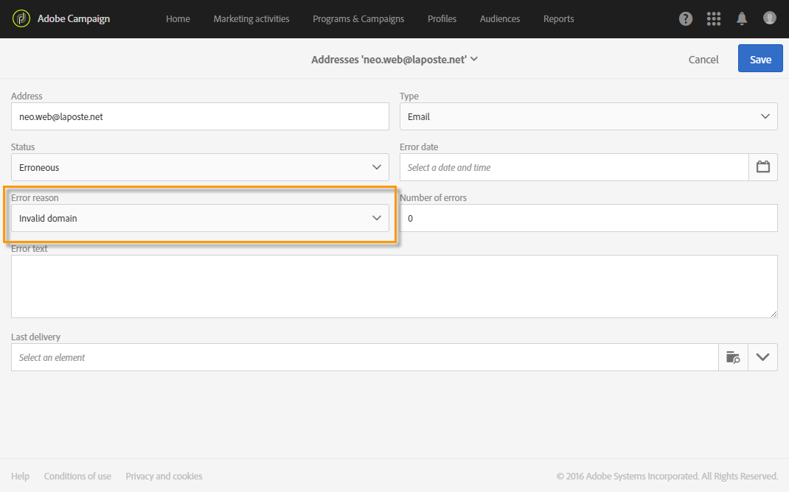

# Informazioni sulla gestione della quarantena{#understanding-quarantine-management}

## Informazioni sulla quarantena {#about-quarantines}

È possibile mettere in quarantena un indirizzo e-mail o un numero di telefono, ad esempio, quando la casella di posta è piena o se l’indirizzo non esiste.

In ogni caso, la procedura di quarantena è conforme alle regole specifiche descritte nella presente [sezione](#conditions-for-sending-an-address-to-quarantine).

### Ottimizzazione della consegna tramite quarantena {#optimizing-your-delivery-through-quarantines}

I profili con indirizzi e-mail o numeri di telefono in quarantena vengono automaticamente esclusi durante la preparazione dei messaggi (vedi [Identificazione degli indirizzi messi in quarantena per una consegna](#identifying-quarantined-addresses-for-a-delivery)). In questo modo le consegne sono più rapide, poiché il tasso di errore ha un effetto significativo sulla velocità di consegna.

Alcuni provider di accesso a Internet considerano automaticamente le e-mail come spam se il tasso di indirizzi non validi è troppo alto. Quarantine quindi consente di evitare di essere aggiunti al elenco Bloccati da questi provider.

Inoltre, le quarantene contribuiscono a ridurre i costi di invio degli SMS escludendo numeri di telefono errati dalle consegne.

Per ulteriori informazioni sulle best practice per proteggere e ottimizzare le consegne, consulta [questa pagina](https://helpx.adobe.com/it/campaign/kb/delivery-best-practices.html).

### Quarantena e Elenco Bloccati {#quarantine-vs-denylist}

La **quarantena** si applica solo a un indirizzo, non a tutto il profilo. Ciò significa che se due profili hanno lo stesso indirizzo e-mail, vengono entrambi coinvolti se l’indirizzo viene messo in quarantena.

Allo stesso modo, un profilo con un indirizzo e-mail messo in quarantena potrebbe aggiornare il profilo e immettere un nuovo indirizzo e potrebbe quindi essere nuovamente indirizzato mediante azioni di consegna.

Being on the **Denylist**, on the other hand, will result in the profile no longer being targeted by any delivery, for example after an unsubscription (opt-out). Per ulteriori informazioni sul processo di elenco Bloccati, consulta [Informazioni sull&#39;opt-in e l&#39;opt-out in Campaign](../../audiences/using/about-opt-in-and-opt-out-in-campaign.md).

>[!NOTE]
>
>Quando un utente risponde a un messaggio SMS con una parola chiave come &quot;STOP&quot; al fine di rifiutare le consegne degli SMS, il suo profilo non è elenco Bloccati al  come nel processo di rifiuto dell&#39;e-mail. Il numero di telefono del profilo viene messo in quarantena con lo stato **[!UICONTROL On denylist]**. Questo stato si riferisce solo al numero di telefono, il profilo non è in elenco Bloccati e l&#39;utente continua a ricevere messaggi e-mail. Per ulteriori informazioni, consulta [questa sezione](../../channels/using/managing-incoming-sms.md#managing-stop-sms).

## Identificazione degli indirizzi messi in quarantena {#identifying-quarantined-addresses}

È possibile elencare gli indirizzi messi in quarantena per una consegna specifica o per l’intera piattaforma.

>[!NOTE]
>
>Se devi rimuovere un indirizzo dalla quarantena, contatta l’amministratore tecnico.

### Identificazione di indirizzi messi in quarantena per una consegna {#identifying-quarantined-addresses-for-a-delivery}

Gli indirizzi in quarantena per una consegna specifica vengono elencati durante la fase di preparazione della consegna, nella scheda **[!UICONTROL Exclusion logs]** del dashboard di consegna (vedi [questa sezione](../../sending/using/monitoring-a-delivery.md#exclusion-logs)). Per ulteriori informazioni sulla preparazione della consegna, consulta [questa sezione](../../sending/using/preparing-the-send.md).

### Identificazione degli indirizzi messi in quarantena per l’intera piattaforma {#identifying-quarantined-addresses-for-the-entire-platform}

Gli amministratori possono elencare gli indirizzi messi in quarantena per l’intera piattaforma dal menu **[!UICONTROL Administration > Channels > Quarantines > Addresses]**.

>[!NOTE]
>
>Questo menu elenca gli elementi messi in quarantena per i canali **e-mail**, **SMS** e di **notifiche push**.

>[!NOTE]
>
>L’aumento del numero delle quarantene è un effetto normale, legato all’&quot;usura&quot; del database. Ad esempio, se la durata di un indirizzo e-mail è considerata di tre anni e la tabella del destinatario aumenta del 50% ogni anno, l’aumento delle quarantene può essere calcolato come segue: fine anno 1: (1*0.33)/(1+0.5)=22%. Fine anno 2: ((1.22*0.33)+0.33)/(1.5+0.75)=32,5%.

## Condizioni per la messa in quarantena di un indirizzo {#conditions-for-sending-an-address-to-quarantine}

Adobe Campaign gestisce la quarantena in base al tipo di consegna non riuscita e al motivo assegnato durante la qualifica dei messaggi di errore (consulta [Tipi di consegna non riuscita e motivi](../../sending/using/understanding-delivery-failures.md#delivery-failure-types-and-reasons) e [Qualifica delle e-mail non recapitate](../../sending/using/understanding-delivery-failures.md#bounce-mail-qualification)).

* **Errore ignorato**: gli errori ignorati non mettono un indirizzo in quarantena.
* **Errore rigido**: l’indirizzo e-mail corrispondente viene messo immediatamente in quarantena.
* **Errore morbido**: gli errori morbidi non mettono immediatamente un indirizzo in quarantena, ma incrementano un contatore di errori. Quando il contatore di errori raggiunge la soglia limite, l’indirizzo viene messo in quarantena. Nella configurazione predefinita, la soglia è impostata a cinque errori, dove due errori sono significativi se si verificano almeno a 24 ore di distanza. L’indirizzo viene messo in quarantena al quinto errore. È possibile modificare la soglia del contatore di errori. Per ulteriori informazioni, consulta questa [pagina](../../administration/using/configuring-email-channel.md#email-channel-parameters).

   Quando una consegna ha esito positivo dopo un nuovo tentativo, viene reinizializzato il contatore di errori dell’indirizzo precedente a quello messo in quarantena. Lo stato dell’indirizzo cambia in **[!UICONTROL Valid]** e viene eliminato dall’elenco della quarantena dopo due giorni dal flusso di lavoro **[!UICONTROL Database cleanup]**.

Se un utente qualifica un’e-mail come spam (**Feedback loop**), il messaggio viene automaticamente reindirizzato verso una casella di posta tecnica gestita da Campaign. L’indirizzo e-mail dell’utente viene quindi messo automaticamente in quarantena con lo stato **[!UICONTROL On denylist]**. Questo stato si riferisce solo all&#39;indirizzo, il profilo non è sul elenco Bloccati, quindi l&#39;utente continua a ricevere messaggi SMS e notifiche push.

>[!NOTE]
In Adobe Campaign la quarantena distingue tra maiuscole e minuscole. Accertati di importare gli indirizzi e-mail in lettere minuscole, in modo che non vengano reindirizzate in un secondo momento.

Nell’elenco degli indirizzi messi in quarantena (vedi [Identificazione degli indirizzi messi in quarantena per l’intera piattaforma](#identifying-quarantined-addresses-for-the-entire-platform)), il campo **[!UICONTROL Error reason]** indica per quale motivo l’indirizzo selezionato è stato messo in quarantena.

