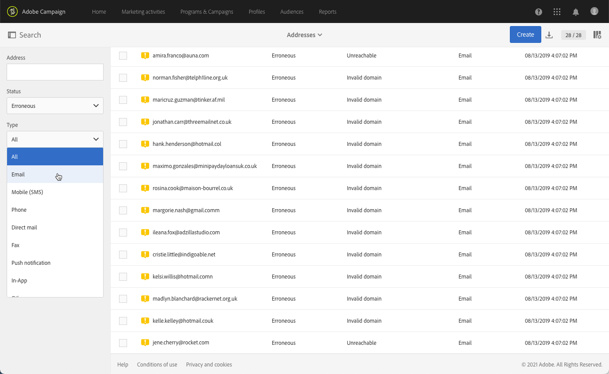
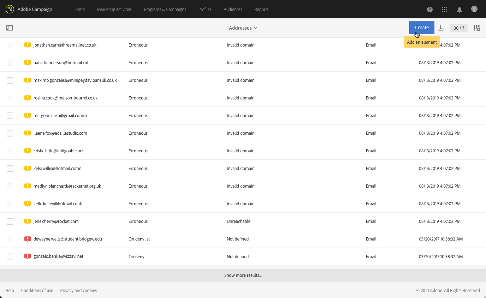

# Informazioni sulla gestione della quarantena{#understanding-quarantine-management}

## Informazioni sulla quarantena {#about-quarantines}

È possibile mettere in quarantena un indirizzo e-mail o un numero di telefono, ad esempio, quando la casella di posta è piena o se l’indirizzo non esiste.

In ogni caso, la procedura di quarantena è conforme alle regole specifiche descritte nella presente [sezione](#conditions-for-sending-an-address-to-quarantine).

### Ottimizzazione della consegna tramite quarantena {#optimizing-your-delivery-through-quarantines}

I profili con indirizzi e-mail o numeri di telefono in quarantena vengono automaticamente esclusi durante la preparazione dei messaggi (vedi [Identificazione degli indirizzi messi in quarantena per una consegna](#identifying-quarantined-addresses-for-a-delivery)). In questo modo le consegne sono più rapide, poiché il tasso di errore ha un effetto significativo sulla velocità di consegna.

Alcuni provider di accesso a Internet considerano automaticamente le e-mail come spam se il tasso di indirizzi non validi è troppo alto. La quarantena consente quindi di evitare che questi provider aggiungano altri elementi al elenco Bloccati del sistema di protezione.

Inoltre, le quarantene contribuiscono a ridurre i costi di invio degli SMS escludendo numeri di telefono errati dalle consegne.

Per ulteriori informazioni sulle best practice per proteggere e ottimizzare le consegne, consulta [questa pagina](../../sending/using/delivery-best-practices.md).

### Quarantena e Inserisco nell&#39;elenco Bloccati di {#quarantine-vs-denylist}

La quarantena e il elenco Bloccati di non si applicano allo stesso oggetto:

* **Quarantena** si applica solo a un **indirizzo** (o numero di telefono, ecc.), non al profilo stesso. Ad esempio, un profilo con un indirizzo e-mail messo in quarantena potrebbe aggiornare il profilo e immettere un nuovo indirizzo, per poi essere nuovamente indirizzato mediante azioni di consegna. Allo stesso modo, se due profili hanno lo stesso numero di telefono, saranno entrambi interessati se il numero viene messo in quarantena.

  Gli indirizzi o i numeri di telefono messi in quarantena vengono visualizzati nei [registri di esclusione](#identifying-quarantined-addresses-for-a-delivery) (per una consegna) o nell&#39;[elenco di quarantena](#identifying-quarantined-addresses-for-the-entire-platform) (per l&#39;intera piattaforma).

* Se invece si trova nel **inserisco nell&#39;elenco Bloccati di**, il **profilo** non sarà più oggetto della consegna, ad esempio dopo l&#39;annullamento dell&#39;abbonamento (opt-out) per un determinato canale. Ad esempio, se un profilo nell’elenco Bloccati di per il canale e-mail ha due indirizzi e-mail, entrambi gli indirizzi verranno esclusi dalla consegna. Per ulteriori informazioni sul processo di inserisco nell&#39;elenco Bloccati di, consulta [Informazioni su consenso e rinuncia in Campaign](../../audiences/using/about-opt-in-and-opt-out-in-campaign.md).

  È possibile verificare se un profilo si trova nel elenco Bloccati di accesso a uno o più canali nella sezione **[!UICONTROL No longer contact (on denylist)]** della scheda **[!UICONTROL General]** del profilo. Consulta [questa sezione](../../audiences/using/managing-opt-in-and-opt-out-in-campaign.md#managing-opt-in-and-opt-out-from-a-profile).

>[!NOTE]
>
>Inserire nell&#39;elenco Bloccati La quarantena include uno stato **Su**, applicabile quando i destinatari segnalano il messaggio come spam o rispondono a un messaggio SMS con una parola chiave come &quot;STOP&quot;. In tal caso, l&#39;indirizzo o il numero di telefono del profilo viene messo in quarantena con lo stato **[!UICONTROL On denylist]**. Per ulteriori informazioni sulla gestione dei messaggi STOP SMS, consulta [questa sezione](../../channels/using/managing-incoming-sms.md#managing-stop-sms).

&lt;!: quando un utente risponde a un messaggio SMS con una parola chiave come STOP per rifiutare le consegne SMS, il suo profilo non viene aggiunto al inserisco nell&#39;elenco Bloccati di, come nel processo di rinuncia alle e-mail. Il numero di telefono del profilo viene messo in quarantena con lo stato **[!UICONTROL On denylist]**. Questo stato si riferisce solo al numero di telefono, il che significa che il profilo continuerà a ricevere messaggi e-mail.<!-- Also, if the profile has another phone number, he can still receive SMS messages on the other number. For more on this, refer to [this section](../../channels/using/managing-incoming-sms.md#managing-stop-sms).-->

## Identificazione degli indirizzi messi in quarantena {#identifying-quarantined-addresses}

Gli indirizzi in quarantena possono essere visualizzati per una consegna specifica o per l’intera piattaforma.

<!--
If you need to remove an address from quarantine, contact your technical administrator.
-->

### Identificazione degli indirizzi messi in quarantena per una consegna {#identifying-quarantined-addresses-for-a-delivery}

Gli indirizzi in quarantena per una consegna specifica vengono elencati durante la fase di preparazione della consegna, nella scheda **[!UICONTROL Exclusion logs]** del dashboard di consegna (vedi [questa sezione](../../sending/using/monitoring-a-delivery.md#exclusion-logs)). Per ulteriori informazioni sulla preparazione della consegna, consulta [questa sezione](../../sending/using/preparing-the-send.md).

### Identificazione degli indirizzi messi in quarantena per l’intera piattaforma {#identifying-quarantined-addresses-for-the-entire-platform}

Gli amministratori possono accedere all&#39;elenco dettagliato degli indirizzi e-mail messi in quarantena per l&#39;intera piattaforma dal menu **[!UICONTROL Administration > Channels > Quarantines > Addresses]**.

<!--
This menu lists quarantined elements for **Email**, **SMS** and **Push notification** channels.
-->

>[!NOTE]
>
>L’aumento del numero di quarantene è un effetto normale, legato all’&quot;usura&quot; del database. Ad esempio, se la durata di un indirizzo e-mail è considerata di tre anni e la tabella del destinatario aumenta del 50% ogni anno, l’aumento delle quarantene può essere calcolato come segue: fine anno 1: (1&#42;0.33)/(1+0.5)=22%. Fine anno 2: ((1,22&#42;0,33)+0,33)/(1,5+0,75)=32,5%.

Sono disponibili filtri per aiutarti a sfogliare l’elenco. Puoi filtrare in base all’indirizzo, allo stato e/o al canale.

Puoi modificare o [eliminare](#removing-a-quarantined-address) ogni voce, nonché crearne di nuove.

Per modificare una voce, fai clic sulla riga corrispondente e modifica i campi in base alle esigenze.

Per aggiungere manualmente una nuova voce, utilizzare il pulsante **[!UICONTROL Create]**.

Definisci l’indirizzo (o il numero di telefono, ecc.) e tipo di canale. È possibile impostare uno stato per l&#39;inserimento nell&#39;elenco di quarantena e un motivo di errore. È inoltre possibile indicare la data in cui si è verificato l&#39;errore, il numero di errori e immettere il testo dell&#39;errore. Se necessario, seleziona dall’elenco a discesa l’ultima consegna inviata all’indirizzo.

## Rimozione di un indirizzo dalla quarantena {#removing-a-quarantined-address}

### Aggiornamenti automatici {#unquarantine-auto}

Gli indirizzi che corrispondono a condizioni specifiche vengono automaticamente eliminati dall’elenco di quarantena dal flusso di lavoro di pulizia del database. Per ulteriori informazioni sui flussi di lavoro tecnici, consulta [questa sezione](../../administration/using/technical-workflows.md#list-of-technical-workflows).

Gli indirizzi vengono rimossi automaticamente dall’elenco di quarantena nei seguenti casi:

* Gli indirizzi con stato **[!UICONTROL Erroneous]** verranno rimossi dall&#39;elenco di quarantena dopo una consegna riuscita.
* Gli indirizzi con lo stato **[!UICONTROL Erroneous]** verranno rimossi dall&#39;elenco di quarantena se l&#39;ultimo messaggio non recapitato è stato eseguito più di 10 giorni fa. Per ulteriori informazioni sulla gestione degli errori software, consulta [questa sezione](#soft-error-management).
* Gli indirizzi con stato **[!UICONTROL Erroneous]** che non hanno superato l&#39;errore **[!UICONTROL Mailbox full]** verranno rimossi dall&#39;elenco di quarantena dopo 30 giorni.

Il loro stato diventa quindi **[!UICONTROL Valid]**.

Il numero massimo di nuovi tentativi da eseguire in caso di stato **[!UICONTROL Erroneous]** e il ritardo minimo tra nuovi tentativi si basano ora sulle prestazioni sia cronologiche che attuali di un IP in un determinato dominio.

>[!IMPORTANT]
>
I destinatari con un indirizzo nello stato **[!UICONTROL Quarantine]** o **[!UICONTROL Denylisted]** non vengono mai rimossi, anche se ricevono un&#39;e-mail.

### Aggiornamenti manuali {#unquarantine-manual}

È inoltre possibile rimuovere manualmente la quarantena di un indirizzo.  Per rimuovere manualmente un indirizzo dall&#39;elenco di quarantena, è possibile rimuoverlo dall&#39;elenco oppure modificarne lo stato in **[!UICONTROL Valid]**.

* Selezionare l&#39;indirizzo dall&#39;elenco **[!UICONTROL Administration > Channels > Quarantines > Addresses]** e selezionare **[!UICONTROL Delete element]**.

  

* Selezionare un indirizzo e modificarne **[!UICONTROL Status]** in **[!UICONTROL Valid]**.

  

### Aggiornamenti in blocco {#unquarantine-bulk}

Potrebbe essere necessario eseguire aggiornamenti in blocco sull’elenco di quarantena, ad esempio in caso di interruzione del servizio dell’ISP. In questo caso, le e-mail vengono erroneamente contrassegnate come mancate consegne perché non possono essere consegnate correttamente al destinatario. Questi indirizzi devono essere rimossi dall’elenco di quarantena.

Per eseguire questa operazione, crea un flusso di lavoro e aggiungi un&#39;attività **[!UICONTROL Query]** nella tabella di quarantena per filtrare tutti i destinatari interessati. Una volta identificate, possono essere rimosse dall’elenco di quarantena e incluse nelle consegne e-mail future di Campaign.

In base alla tempistica dell’incidente, di seguito sono riportate le linee guida consigliate per questa query.

* **Testo di errore (testo quarantena)** contiene &quot;550-5.1.1&quot; E **Testo di errore (testo quarantena)** contiene &quot;support.ISP.com&quot;

  dove &quot;support.ISP.com&quot; può essere: &quot;support.apple.com&quot; o &quot;support.google.com&quot;, ad esempio

* **Aggiorna stato (@lastModified)** in data o dopo `MM/DD/YYYY HH:MM:SS AM`
* **Aggiorna stato (@lastModified)** in data `MM/DD/YYYY HH:MM:SS PM` o prima

Una volta ottenuto l&#39;elenco dei destinatari interessati, aggiungere un&#39;attività **[!UICONTROL Update data]** per impostare lo stato del loro indirizzo e-mail su **[!UICONTROL Valid]** in modo che vengano rimossi dall&#39;elenco di quarantena dal flusso di lavoro **[!UICONTROL Database cleanup]**. Puoi anche semplicemente eliminarli dalla tabella di quarantena.

## Condizioni per la messa in quarantena di un indirizzo {#conditions-for-sending-an-address-to-quarantine}

Adobe Campaign gestisce la quarantena in base al tipo di consegna non riuscita e al motivo assegnato durante la qualifica dei messaggi di errore (consulta [Tipi di consegna non riuscita e motivi](../../sending/using/understanding-delivery-failures.md#delivery-failure-types-and-reasons) e [Qualifica delle e-mail non recapitate](../../sending/using/understanding-delivery-failures.md#bounce-mail-qualification)).

* **Errore ignorato**: gli errori ignorati non mettono un indirizzo in quarantena.
* **Errore rigido**: l’indirizzo e-mail corrispondente viene messo immediatamente in quarantena.
* **Errore morbido**: gli errori morbidi non mettono immediatamente un indirizzo in quarantena, ma incrementano un contatore di errori. Per ulteriori informazioni, consulta [Gestione degli errori software](#soft-error-management).

  <!--
  When the error counter reaches the limit threshold, the address goes into quarantine. In the default configuration, the threshold is set at five errors, where two errors are significant if they occur at least 24 hours apart. The address is placed in quarantine at the fifth error. The error counter threshold can be modified. For more on this, refer to this [page](../../administration/using/configuring-email-channel.md#email-channel-parameters).
  When a delivery is successful after a retry, the error counter of the address which was prior to that quarantined is reinitialized. The address status changes to **[!UICONTROL Valid]** and it is deleted from the list of quarantines after two days by the **[!UICONTROL Database cleanup]** workflow.
  -->

Se un utente qualifica un&#39;e-mail come spam ([ciclo di feedback](https://experienceleague.adobe.com/docs/deliverability-learn/deliverability-best-practice-guide/transition-process/infrastructure.html#feedback-loops)), il messaggio viene automaticamente reindirizzato a una cassetta postale tecnica gestita dall&#39;Adobe. L’indirizzo e-mail dell’utente viene quindi messo automaticamente in quarantena con lo stato **[!UICONTROL On denylist]**. Questo stato si riferisce solo all’indirizzo, il profilo non è nel inserisco nell&#39;elenco Bloccati di, in modo che l’utente continui a ricevere messaggi SMS e notifiche push.

>[!NOTE]
>
In Adobe Campaign la quarantena distingue tra maiuscole e minuscole. Accertati di importare gli indirizzi e-mail in lettere minuscole, in modo che non vengano reindirizzate in un secondo momento.

Nell’elenco degli indirizzi messi in quarantena (vedi [Identificazione degli indirizzi messi in quarantena per l’intera piattaforma](#identifying-quarantined-addresses-for-the-entire-platform)), il campo **[!UICONTROL Error reason]** indica per quale motivo l’indirizzo selezionato è stato messo in quarantena.

### Gestione degli errori morbidi {#soft-error-management}

Al contrario degli errori rigidi, gli errori morbidi non mettono immediatamente un indirizzo in quarantena, ma incrementano un contatore di errori.

I tentativi verranno eseguiti durante la [durata della consegna](../../administration/using/configuring-email-channel.md#validity-period-parameters). Quando il contatore di errori raggiunge la soglia limite, l’indirizzo viene messo in quarantena. Per ulteriori informazioni, consulta [Tentativi dopo un errore temporaneo di consegna](understanding-delivery-failures.md#retries-after-a-delivery-temporary-failure).

<!--In the default configuration, the threshold is set at five errors, where two errors are significant if they occur at least 24 hours apart. The address is placed in quarantine at the fifth error.
The error counter threshold can be modified.-->

Il contatore degli errori viene reinizializzato se l&#39;ultimo errore significativo si è verificato più di 10 giorni fa. Lo stato dell&#39;indirizzo cambia quindi in **Valido** e viene eliminato dall&#39;elenco delle quarantene dal flusso di lavoro **Database cleanup**. Per ulteriori informazioni sui flussi di lavoro tecnici, consulta [questa sezione](../../administration/using/technical-workflows.md#list-of-technical-workflows).
