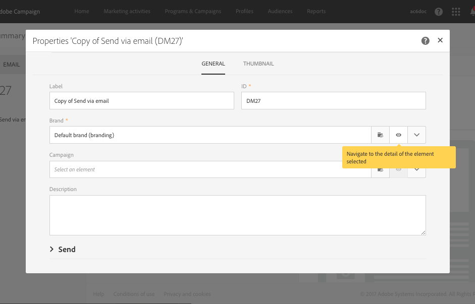

# Utilizzare i modelli {#use-templates}

I modelli di distribuzione consentono una maggiore efficienza fornendo scenari pronti per la maggior parte dei tipi di attività più comuni. Grazie ai modelli, gli esperti di marketing possono distribuire nuove campagne con una personalizzazione minima in tempi più brevi.

Ulteriori informazioni sui modelli di consegna in [questa sezione](../../start/using/marketing-activity-templates.md).

## Guida introduttiva ai modelli di distribuzione {#gs-templates}

Un modello [di](../../start/using/marketing-activity-templates.md#creating-a-new-template) consegna consente di definire una volta un insieme di proprietà tecniche e funzionali in base alle esigenze e che possono essere riutilizzate per le consegne future. È quindi possibile risparmiare tempo e standardizzare le consegne quando necessario.

Quando gestite diversi marchi in  Adobe Campaign,  Adobe consiglia di avere un sottodominio per marchio. Ad esempio, una banca può avere diversi sottodomini corrispondenti a ciascuna delle sue agenzie regionali. Se una banca possiede il dominio bluebank.com, i relativi sottodomini possono essere @ny.bluebank.com, @ma.bluebank.com, @ca.bluebank.com, ecc. La possibilità di disporre di un modello di consegna per sottodominio consente di utilizzare sempre i parametri preconfigurati corretti per ogni marchio, evitando errori e risparmiando tempo.

**Suggerimento**:  Per evitare errori di configurazione in Campaign, consigliamo di duplicare un modello nativo e modificarne le proprietà invece di creare un nuovo modello.

## Configurare gli indirizzi

* L&#39;indirizzo del mittente è obbligatorio per consentire l&#39;invio di un&#39;e-mail.

* Alcuni ISP (provider di servizi Internet) controllano la validità dell&#39;indirizzo del mittente prima di accettare i messaggi.

* Un indirizzo con formato non corretto potrebbe essere rifiutato dal server ricevente. Devi accertarti che sia specificato l&#39;indirizzo corretto.

* L&#39;indirizzo deve identificare esplicitamente il mittente. Il dominio deve essere di proprietà e registrato del mittente.

*  Adobe consiglia di creare account e-mail corrispondenti agli indirizzi specificati per le consegne e le risposte. Consultate l’amministratore del sistema di messaggistica.

Nella **[!UICONTROL Advanced parameters]** sezione delle proprietà del modello e-mail, il **[!UICONTROL From (email address)]** campo corrisponde all&#39;indirizzo del mittente.

Il dominio indirizzo deve essere lo stesso del sottodominio delegato al Adobe .

I **[!UICONTROL Reply to]** campi corrispondono all’indirizzo e-mail e al nome utilizzati per le risposte.

**Suggerimento** :  Adobe consiglia di utilizzare un indirizzo reale esistente, ad esempio l&#39;assistenza clienti del tuo marchio. In questo caso, se un destinatario invia una risposta, l&#39;assistenza clienti sarà in grado di gestirla.

Per modificare il nome del mittente che verrà visualizzato nell&#39;intestazione dei messaggi inviati, passare alla **[!UICONTROL Properties]** scheda della home page di Designer e-mail (accessibile tramite l&#39;icona principale) e fare clic sul **[!UICONTROL Default sender name]** blocco.

Per aumentare il tasso di apertura delle consegne,  Adobe consiglia di utilizzare un nome facilmente identificabile dai destinatari, ad esempio il nome del marchio.

**Suggerimento** - Per migliorare ulteriormente l&#39;esperienza del destinatario, puoi aggiungere il nome di una persona, ad esempio &quot;Emma da Megastore&quot;.

Per ulteriori informazioni sulla personalizzazione del nome del mittente, consulta Mittente [e-](../../designing/using/subject-line.md#email-sender)mail.

## Personalizzare il nome del mittente SMS

Nella sezione Parametri **** avanzati delle proprietà di un modello SMS, l&#39;opzione **Da** consente di personalizzare il nome del mittente del messaggio SMS utilizzando una stringa di caratteri. Questo è il nome visualizzato come mittente del messaggio SMS sul telefono cellulare del destinatario.

Se questo campo è vuoto, viene quindi utilizzato il numero di origine fornito nell’account esterno. Se non viene fornito alcun numero di origine, viene utilizzato il codice breve. Per ulteriori informazioni, consulta la sezione [Configurazione degli SMS](../../administration/using/configuring-sms-channel.md).

**Suggerimento** - Controlla la legislazione del tuo paese riguardo alla modifica dell&#39;indirizzo del mittente. Dovresti anche verificare con il provider di servizi SMS se offre questa funzionalità.

## Impostazione di un gruppo di controllo

Una volta inviata la consegna, potete confrontare il comportamento dei destinatari esclusi con quello dei destinatari che hanno ricevuto la consegna. Potete quindi misurare l&#39;efficienza delle campagne. Ulteriori informazioni sui gruppi di controllo [in questa sezione](../../sending/using/control-group.md).

## Utilizzare le tipologie per applicare filtri o regole di controllo

Una tipologia contiene le regole di controllo applicate durante la fase di analisi, prima di inviare qualsiasi messaggio.

Nella sezione **[!UICONTROL Advanced parameters]** > **[!UICONTROL Preparation]** delle proprietà del modello, modificate la tipologia predefinita in base alle vostre esigenze.

Ad esempio, per controllare meglio il traffico in uscita, potete definire gli indirizzi IP da utilizzare definendo un&#39;affinità per sottodominio e creando una tipologia per affinità. Le affinità sono definite nel file di configurazione dell&#39;istanza. Contattate l’amministratore  Adobe Campaign.

For more on typologies, refer to [this section](../../sending/using/managing-typologies.md).

## Collegare un marchio a un modello

I parametri delle e-mail inviate relativi all&#39;identità di un marchio (ad esempio il logo del marchio o l&#39;indirizzo del mittente) vengono gestiti centralmente in  Adobe Campaign. Potete creare uno o più marchi e collegarli ai modelli di consegna.

Per ulteriori informazioni sull’uso e la configurazione dei marchi in  Adobe Campaign, consulta Branding.

Per visualizzare o modificare il marchio assegnato a un modello di consegna, fate clic sul pulsante Modifica proprietà del modello e individuate i dettagli del marchio.

Per ulteriori informazioni sul collegamento di un marchio a un modello, consulta [Assegnazione di un marchio a un’e-mail](../../administration/using/branding.md#assigning-a-brand-to-an-email).

Scopri come creare e configurare un marchio [in questa sezione](../../administration/using/branding.md#creating-a-brand).
