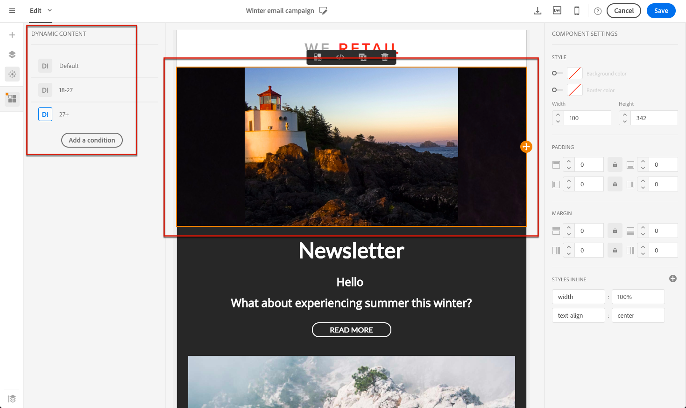

# Dynamic and personalized content{#dynamic-and-personalized-content}

Attirare l'attenzione dei clienti e migliorare il tasso di risposta utilizzando contenuti e intestazioni personalizzate in base ai profili, alle preferenze e alla loro attività. Tutte le informazioni sui clienti sono centralizzate in Adobe Campaign ed è possibile offrire messaggi con contenuto adattivo, tramite canali diversi.

I messaggi personalizzati sono chiave per inviare contenuti pertinenti, offrire esperienze personalizzate e aumentare i tassi di apertura e conversione. I messaggi cross-channel inviati da Adobe Campaign possono essere personalizzati in diversi modi. Questi metodi possono essere combinati con criteri a seconda dei profili. Potete:

* Insert [dynamic personalization fields](../../designing/using/inserting-a-personalization-field.md) in your messages
* Insert [predefined personalization blocks](../../designing/using/adding-a-content-block.md)
* [Personalizzare il mittente](../../designing/using/personalizing-the-sender.md) di un'e-mail o di un SMS
* [Personalizzate l'oggetto](../../designing/using/personalizing-the-subject-line-of-an-email.md) di un'e-mail o utilizzate [le funzionalità dell'oggetto](../../designing/using/personalizing-the-subject-line-of-an-email.md#predictive-subject-line) Predittivo per ottimizzarlo
* Create [conditional content in an email](../../designing/using/defining-dynamic-content-in-an-email.md) or [in a landing page](../../designing/using/defining-dynamic-content-in-a-landing-page.md)
* Insert [Dynamic text](../../designing/using/defining-dynamic-text.md) in a SMS message or a Push notification

**Argomenti correlati:**

* Discover email personalization through a [end-to-end sample](../../designing/using/example--email-personalization.md)
* Learn how to personalize URLs [in this page](../../designing/using/personalizing-urls.md)
* Learn how to set up personalization of an image [in this page](../../designing/using/personalizing-an-image-source.md)

