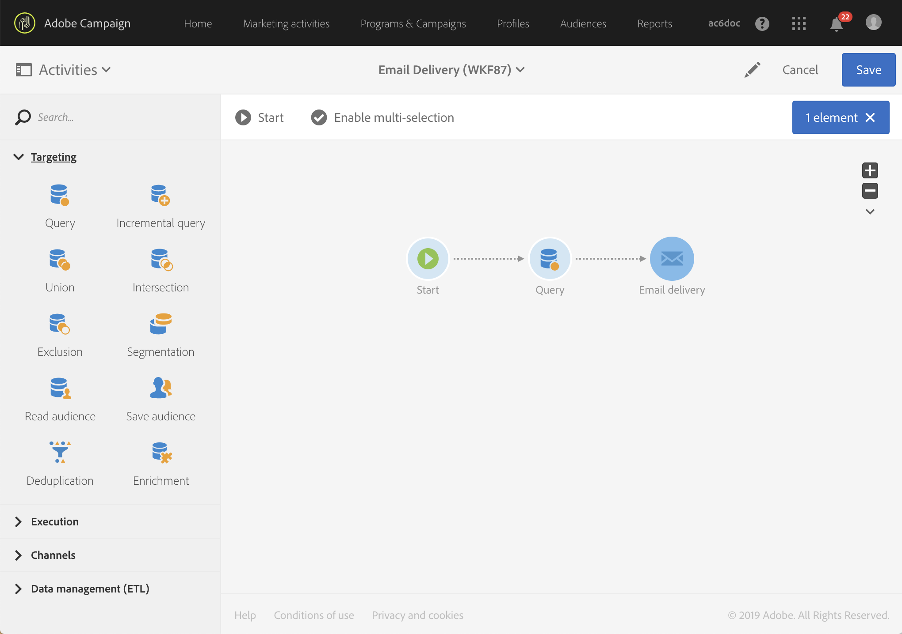
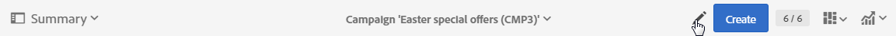

# Descrizione interfaccia{#interface-description}

Adobe Campaign ti consente di navigare tra i vari menu e schermate per gestire le campagne.

Tutte le schermate di Adobe Campaign sono composte dai seguenti elementi:

* Una barra superiore per la navigazione
* Un menu avanzato per accedere a funzionalità e configurazioni specifiche
* Una zona centrale per lavorare su alcuni elementi
* Un pannello laterale, a seconda del contesto, per filtrare o eseguire ricerche all’interno degli elementi visualizzati.

## Pagina Home {#home-page}

La pagina Home è composta da una serie di schede che ti offrono un accesso rapido alle funzionalità principali di Adobe Campaign. L’elenco delle capacità che puoi visualizzare nella pagina Home di Campaign dipende dalle autorizzazioni in tuo possesso e dalle opzioni configurate per la tua organizzazione.

* La scheda **[!UICONTROL Create an email]** ti porta all’assistente di creazione delle e-mail. L’assistente ti consente di scegliere un tipo di e-mail, di selezionare i destinatari del messaggio e di definirne il contenuto. Consulta la sezione [Creazione di un messaggio e-mail](../../channels/using/creating-an-email.md).
* La scheda **[!UICONTROL Create an SMS]** ti porta all’assistente di creazione SMS. L’assistente ti consente di scegliere un tipo di SMS, selezionare i destinatari del messaggio e definirne il contenuto. Consulta la sezione [Creazione di un SMS](../../channels/using/creating-an-sms-message.md).
* La scheda **[!UICONTROL Create a Direct mail]** ti porta all’assistente per la creazione di direct mailing. Consulta la sezione [Creazione della direct mailing](../../channels/using/creating-the-direct-mail.md).
* La scheda **[!UICONTROL Create a push notification]** ti porta all’assistente per la creazione delle notifiche. L’assistente ti consente di scegliere un tipo di notifica push, di selezionare i destinatari del messaggio e di definirne il contenuto. Consulta la sezione [Creazione di una notifica push](../../channels/using/preparing-and-sending-a-push-notification.md).
* La scheda **[!UICONTROL Create an InApp message]** ti porta all’assistente per la creazione InApp. L’assistente ti consente di selezionare il tipo di messaggio InApp che desideri creare, definirne le relative proprietà, il pubblico e il contenuto. Consulta la sezione [Creazione di un messaggio InApp](../../channels/using/about-in-app-messaging.md).
* La scheda **[!UICONTROL Marketing activities]** contiene l’elenco completo di tutte le attività, i programmi e le campagne, in particolare e-mail, SMS, flussi di lavoro e pagine di destinazione. Da qui puoi filtrare gli elementi ricercandoli per nome, data, stato o tipo di attività. Per ulteriori informazioni, consulta la sezione [Elenco delle attività di marketing](../../start/using/marketing-activities.md#about-marketing-activities).
* La scheda **[!UICONTROL Programs & campaigns]** ti consente di visualizzare l’elenco dei programmi in cui puoi creare e gestire le campagne. Consulta [Elenco programmi](../../start/using/programs-and-campaigns.md#about-plans--programs-and-campaigns).
* La scheda **[!UICONTROL Timeline]** ti porta direttamente a una cronologia interattiva delle attività di marketing, nella quale puoi consultare i programmi in corso e i relativi contenuti. Consulta la [Timeline](../../start/using/timeline.md).
* La scheda **[!UICONTROL Customer profiles]** ti porta direttamente all’elenco dei profili. Da qui puoi consultare gli eventi relativi a ciascuno dei profili presenti nel tuo elenco. Consulta [Gestione dei profili](../../audiences/using/about-profiles.md).
* La scheda **[!UICONTROL Audiences]** ti porta direttamente all’elenco dei tipi di pubblico. Da qui puoi accedere ai tipi di pubblico esistenti e crearne di nuovi. Consulta [Gestione dei tipi di pubblico](../../audiences/using/about-audiences.md).

## Barra superiore {#top-bar}

La barra superiore è visibile su ogni schermata e consente di navigare tra le funzionalità di Adobe Campaign, nonché di accedere al profilo Adobe connesso, alle notifiche, ad altri servizi e soluzioni Adobe Experience Cloud e alla documentazione.

I principi di navigazione sono i seguenti:

* Il logo **[!UICONTROL Adobe Campaign]** nell’angolo in alto a sinistra della pagina ti consente di accedere alle funzioni e alle configurazioni avanzate. I menu dipendono dal profilo e dalle autorizzazioni.

   Il menu avanzato è presentato nella sezione [Menu avanzato](#advanced-menu).

* Il collegamento **[!UICONTROL Home]** ti consente di visualizzare la pagina Home di Adobe Campaign.
* I collegamenti **[!UICONTROL Marketing activities]**, **[!UICONTROL Programs & Campaigns]**, **[!UICONTROL Profiles]**, **[!UICONTROL Audiences]** e **[!UICONTROL Reports]** ti consentono di accedere alle viste collegate a tali funzionalità.
* Il pulsante **[!UICONTROL Help]** ti permette di accedere alla documentazione del prodotto e all’aiuto contestuale, alle note sulla versione, ai numeri di versione, alle note legali, nonché ai collegamenti alla community di Adobe Experience Cloud e all’assistenza cliente.

   

* L’icona **Seleziona soluzione** ti consente di passare a un’altra soluzione Adobe Experience Cloud, oltre che alle impostazioni del profilo.
* L’icona **Notifications** visualizza gli avvisi o le informazioni più recenti.
* L’icona **User** ti consente di visualizzare le informazioni collegate al profilo. Ti permette di accedere al pulsante **[!UICONTROL Sign out]**.

## Menu avanzato {#advanced-menu}

Il menu avanzato viene visualizzato facendo clic sull’icona di **Adobe Campaign**, nell’angolo in alto a sinistra di ciascuna schermata. Il menu avanzato può variare a seconda del contratto e delle autorizzazioni dell’utente.

Questo menu ti consente di passare a specifiche funzionalità e impostazioni.

### Marketing plans {#marketing-plans}

L’icona **[!UICONTROL Marketing plans]** ti permette di accedere alle seguenti funzionalità:

* **[!UICONTROL Marketing activities]** - per ulteriori informazioni, consulta la sezione [Elenco delle attività di marketing](../../start/using/marketing-activities.md#about-marketing-activities).
* **[!UICONTROL Programs & Campaigns]**. Per ulteriori informazioni, consulta la sezione [Elenco programmi](../../start/using/programs-and-campaigns.md#about-plans--programs-and-campaigns).
* **[!UICONTROL Timeline]**. Per ulteriori informazioni, fai riferimento alla sezione [Timeline](../../start/using/timeline.md).
* **[!UICONTROL Transactional messages]**, che contiene i sottomenu **[!UICONTROL Deliveries]** e **[!UICONTROL Event configuration]**. Per ulteriori informazioni, consulta la sezione [Messaggistica transazionale](../../channels/using/getting-started-with-transactional-msg.md).

### Profiles &amp; audiences {#profiles-e-audiences}

L’icona **[!UICONTROL Profiles & audiences]** ti permette di accedere alle seguenti funzionalità:

* **[!UICONTROL Profiles]**. Per ulteriori informazioni, consulta la sezione [Gestione dei profili](../../audiences/using/about-profiles.md).
* **[!UICONTROL Test profiles]**. Per ulteriori informazioni, consulta la sezione [Gestione dei profili di test](../../audiences/using/managing-test-profiles.md).
* **[!UICONTROL Audiences]**. Per ulteriori informazioni, consulta la sezione [Gestione dei tipi di pubblico](../../audiences/using/about-audiences.md).
* **[!UICONTROL Services]**. Per ulteriori informazioni, consulta la sezione [Creazione di un servizio](../../audiences/using/creating-a-service.md).

### Resources {#resources}

L’icona **[!UICONTROL Resources]** ti permette di accedere alle seguenti funzionalità:

* **[!UICONTROL Templates]**, che contiene i sottomenu per ciascun tipo di modello. Per ulteriori informazioni, consulta la sezione [Gestione dei modelli](../../start/using/marketing-activity-templates.md).
* **[!UICONTROL Content blocks]**. Per ulteriori informazioni, consulta la sezione [Aggiunta di un blocco di contenuto](../../designing/using/personalization.md#adding-a-content-block).
* **[!UICONTROL Content templates & fragments]**. Per ulteriori informazioni, consulta la sezione [Modello di contenuto](../../designing/using/using-reusable-content.md#content-templates).

### Administration {#administration}

L’icona **[!UICONTROL Administration]** ti permette di accedere alle funzionalità avanzate che possono essere eseguite solo da un amministratore funzionale. Per ulteriori informazioni, consulta la sezione [Amministrazione](../../administration/using/get-started-campaign-administration.md).

## Zona centrale {#central-zone}

La zona centrale dell’interfaccia utente è una zona dinamica che contiene, ad esempio, un elenco di elementi o un set di schede. Questa zona ti consente di modificare gli elementi esistenti e di creare risorse.

Il contenuto e il formato di visualizzazione della zona centrale possono variare:

* Un **elenco** che presenta vari elementi quali programmi, campagne, profili e così via. Questi elementi possono essere visualizzati in modalità **[!UICONTROL Card]** o **[!UICONTROL List]**. Utilizza il pulsante di modifica modalità per passare da una all’altra. Ogni elemento visualizza degli indicatori.

   

   Un contatore consente di conoscere il numero degli elementi. Se questo numero supera i 30, è necessario fare clic su questo contatore per ottenere il numero totale.

* Un **dashboard** che presenta una panoramica di tutti i parametri collegati a un’attività. Questa schermata include aree interattive che ti consentono di separare e configurare i diversi concetti in modo indipendente.

   

* Se durante la creazione di un elemento sono possibili diverse offerte, una **schermata di selezione** ti consente di scegliere il tipo di elemento da aggiungere (campagne, consegne). Questa schermata di selezione è disponibile anche per accedere ai report.

   

* Per i flussi di lavoro e per l’editor delle query, è disponibile un’**area di lavoro** con una palette per la progettazione dell’oggetto.

   Puoi trascinare e rilasciare gli elementi dalla palette nell’area di lavoro e configurare così l’elemento in questione.

   

## Barra delle azioni {#action-bar}

In base al tipo di schermata mostrata, nella parte superiore viene visualizzata una barra contenente azioni collegate alla schermata.

Questa barra contiene non solo azioni comuni quali ricerca e filtro, ma anche altre relative alla schermata visualizzata:

* Per le azioni che riguardano le schermate di tipo **area di lavoro**, fai riferimento alla sezione della [Barra delle azioni](../../automating/using/workflow-interface.md#action-bar) relativa ai flussi di lavoro.
* Per ulteriori informazioni sulle azioni relative alle schermate del **dashboard**, consulta la sezione [Dashboard dei messaggi](../../channels/using/message-dashboard.md).
* Per le azioni relative alle schermate di tipo **elenco**, fai riferimento alla sezione seguente [Personalizzazione degli elenchi](../../start/using/customizing-lists.md).
