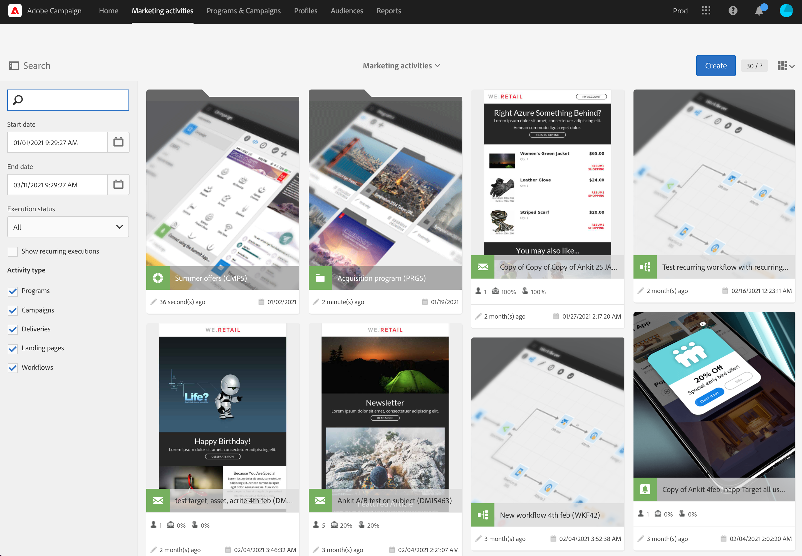

# Attività di marketing{#marketing-activities}

## Informazioni sulle attività di marketing {#about-marketing-activities}

Puoi creare e gestire le tue attività di marketing dai programmi e dalle campagne a cui appartengono oppure tramite l’elenco delle attività di marketing.

L’elenco delle attività di marketing centralizza tutte le attività, indipendentemente dai programmi o dalle campagne in cui sono state create. Programmi, campagne, consegne (e-mail, messaggi SMS e notifiche push), pagine di destinazione e flussi di lavoro non sono quindi visualizzati in dettaglio in un ordine gerarchico particolare.

Per accedere all’elenco delle attività di marketing, scegli il collegamento **[!UICONTROL Marketing activities]** dalla barra superiore.

>[!NOTE]
>
>Per accedere alle attività di marketing, seleziona la scheda **[!UICONTROL Marketing activities]** dalla pagina Home.

Il riquadro **[!UICONTROL Search]** ti consente di filtrare gli elementi in base a diversi criteri: nome (etichetta e ID), data, stato o tipo di attività. Per impostazione predefinita, sono selezionati tutti i tipi di attività, tranne i programmi.

Per accedere direttamente al contenuto di ogni attività, scegli uno degli elementi dall’elenco.

Il pulsante **[!UICONTROL Create]** può essere utilizzato per creare una nuova attività. Per ulteriori informazioni, consulta la sezione [Creazione di un’attività di marketing](#creating-a-marketing-activity).

## Icone e stati dell’attività di marketing {#marketing-activity-icons-and-statuses}

Nella zona principale, ogni tipo di attività nell’elenco è dotata di un’icona:

*  programma
*  campagna
*  e-mail
*  SMS
*  notifica push
*  Messaggio in-app
*  pagina di destinazione
*  Flusso di lavoro

A seconda del periodo di validità e dello stato, il colore associato a questa icona indica lo stato di esecuzione dell’attività corrispondente.

* Grigio: l’attività non è ancora iniziata - stato **[!UICONTROL Editing]**.
* Blu: l’attività è in corso - stato **[!UICONTROL In progress]**.
* Verde: l’attività è terminata - stato **[!UICONTROL Finished]**.
* Giallo: l’attività ha ricevuto un avviso - stato **[!UICONTROL Warning]**.
* Rosso: si è verificato un errore - stato **[!UICONTROL Erroneous]**.

## Creazione di un’attività di marketing {#creating-a-marketing-activity}

Da una campagna esistente puoi creare diversi tipi di messaggi (**e-mail**, **SMS**, **notifiche push** e così via), flussi di lavoro e pagine di destinazione.

Da un programma esistente puoi creare altri programmi, campagne, flussi di lavoro e pagine di destinazione.

>[!NOTE]
>
>Valuta di eseguire la creazione di flussi di lavoro direttamente all’interno di una campagna. Se crei un flusso di lavoro all’interno di un programma, non sarà più possibile spostarlo in una campagna.

I programmi e le campagne sono illustrati nella sezione [Programmi e campagne](../../start/using/programs-and-campaigns.md).

1. Nel dashboard di un programma o di una campagna, crea una nuova attività di marketing utilizzando il pulsante **[!UICONTROL Create]**.

   

1. Seleziona il tipo di attività da creare.

   

A seconda del contesto, è possibile:

* Crea un messaggio e-mail - [Ulteriori informazioni](../../channels/using/creating-an-email.md)
* Crea un SMS - [Ulteriori informazioni](../../channels/using/creating-an-sms-message.md)
* Creare una notifica push - [Ulteriori informazioni](../../channels/using/preparing-and-sending-a-push-notification.md)
* Creare un messaggio in-app - [Ulteriori informazioni](../../channels/using/about-in-app-messaging.md)
* Creare un flusso di lavoro - [Ulteriori informazioni](../../automating/using/building-a-workflow.md#creating-a-workflow)
* Creare una pagina di destinazione - [Ulteriori informazioni](../../channels/using/getting-started-with-landing-pages.md)
* Creare una campagna - [Ulteriori informazioni](../../start/using/programs-and-campaigns.md#creating-a-campaign)
* Crea un programma - [Ulteriori informazioni](../../start/using/programs-and-campaigns.md#creating-a-program)

>[!NOTE]
>
>Puoi anche creare un’attività di marketing dall’elenco relativo. In questo caso, puoi creare qualsiasi tipo di attività e scegliere di collegare l’attività di marketing a una campagna principale (o a un programma principale, se crei un programma) tramite le proprietà dell’attività.
