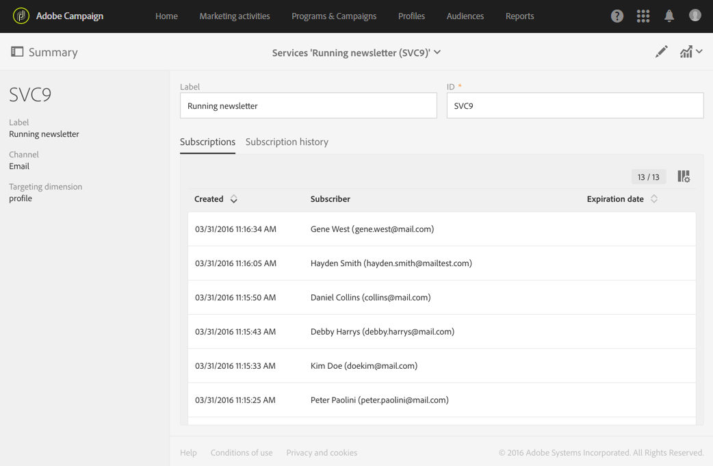
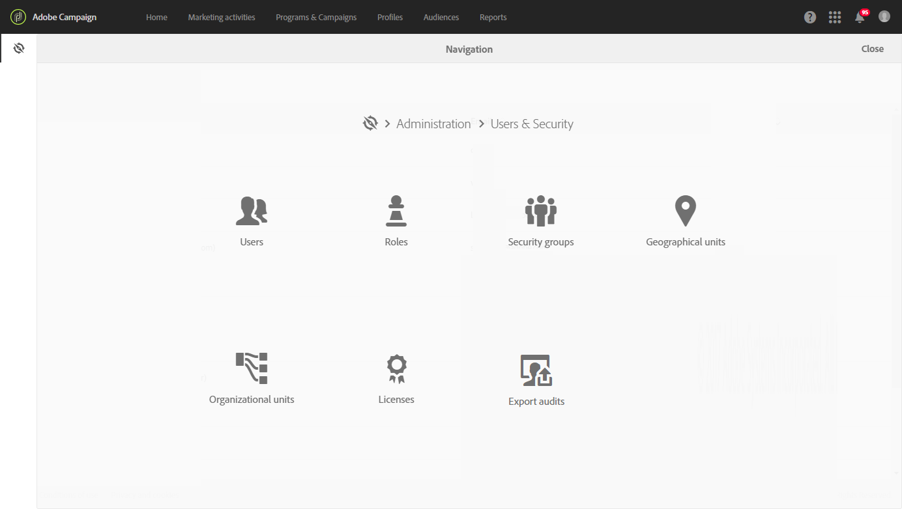

# Gestione della privacy {#privacy-management}

 Adobe Campaign offre una serie di strumenti per aiutarti a rispettare le normative sulla privacy (tra cui GDPR, CCPA, PDPA, LGPD).

* Questa sezione contiene informazioni generali sulla gestione della privacy e sulle funzioni fornite da  Adobe Campaign per gestire il [Diritto di accesso e il Diritto di essere Dimenticato](#right-access-forgotten).

* Contiene inoltre informazioni su importanti funzioni per la gestione della privacy ([consenso, conservazione dei dati e ruoli](#consent-retention-roles)utente), nonché procedure ottimali per l&#39;utilizzo di  Adobe Campaign da parte dell&#39;utente, al fine di garantire la conformità alla privacy.

## Regolamenti sulla gestione della privacy {#privacy-management-regulations}

 le funzionalità di Adobe Campaign consentono di rispettare i seguenti regolamenti:

* **Il GDPR** ([General Data Protection Regulation](https://ec.europa.eu/info/law/law-topic/data-protection/reform/what-does-general-data-protection-regulation-gdpr-govern_en)) è la normativa dell&#39;Unione europea sulla privacy che armonizza e aggiorna i requisiti di protezione dei dati per i paesi dell&#39;UE.
* **CCPA** ([California Consumer Privacy Act](https://leginfo.legislature.ca.gov/faces/codes_displayText.xhtml?lawCode=CIV&amp;division=3.&amp;title=1.81.5.&amp;part=4.&amp;Chapter=&amp;article=)) conferisce ai residenti della California nuovi diritti in merito alle loro informazioni personali e impone loro responsabilità in materia di protezione dei dati a determinate entità che svolgono attività in California.
* **PDPA** ([Personal Data Protection Act](https://secureprivacy.ai/thailand-pdpa-summary-what-businesses-need-to-know/)) è la nuova legge sulla privacy che armonizza e aggiorna i requisiti di protezione dei dati per la Thailandia.
* **La LGPD** ([Lei Geral de Proteção de Dados](https://iapp.org/media/pdf/resource_center/Brazilian_General_Data_Protection_Law.pdf)) sarà effettiva all&#39;inizio del 2021 per tutte le aziende che raccolgono o trattano dati personali in Brasile.

Tutte queste normative si applicano ai clienti  Adobe Campaign che detengono dati per gli oggetti dati residenti nelle rispettive regioni o paesi sopra menzionati (UE, California, Thailandia, Brasile).

>[!NOTE]
>
>Per ulteriori informazioni sui dati personali e sulle diverse entità che gestiscono i dati (Titolare del trattamento dei dati, Processore dati e Oggetto dati), consulta Dati [personali e Personas](../../start/using/privacy.md#personal-data).

## Diritto di accesso e diritto di essere dimenticato {#right-access-forgotten}

Per facilitare la preparazione alla privacy,  Adobe Campaign consente di gestire le richieste di **accesso** ed **eliminazione** .

* Il **diritto di accesso** è il diritto per l&#39;interessato di ottenere dalla conferma del Titolare dei Dati se i dati personali che li riguardano sono trattati, dove e a quale scopo. Il titolare del trattamento fornisce gratuitamente una copia dei dati personali in formato elettronico.

* Anche noto come Data Erasure, il **Diritto di essere Dimenticato** (richiesta di cancellazione) autorizza l&#39;interessato a far cancellare i propri dati personali, cessare l&#39;ulteriore diffusione dei dati e potenzialmente far cessare il trattamento dei dati da parte di terzi.

Per informazioni su come creare le richieste di **accesso** ed **eliminazione** e su come  Adobe Campaign le elabora, fare riferimento ai passaggi [di](../../start/using/privacy-requests.md#about-privacy-requests)implementazione.

Tutorials sulla gestione della privacy in Campaign Standard sono disponibili anche [qui](https://experienceleague.adobe.com/docs/campaign-standard-learn/tutorials/privacy/privacy-overview.html?lang=en#privacy).

## Consenso, mantenimento e ruoli {#consent-retention-roles}

Oltre alle più recenti funzionalità **Diritto di accesso** e **Diritto di essere Dimenticato** ,  Adobe Campaign offre altre importanti caratteristiche essenziali per la Privacy:

* [Gestione](#consent-management)del consenso: funzionalità di iscrizione per la gestione delle preferenze
* [Conservazione](#data-retention)dei dati: periodi di conservazione dei dati in tutte le tabelle di registro standard, con flussi di lavoro è possibile impostare periodi di conservazione aggiuntivi
* [Gestione](#rights-management)dei diritti: accesso ai dati gestito da named right

### Gestione del consenso {#consent-management}

Il consenso è l&#39;accordo tra l&#39;interessato al trattamento dei dati personali relativi ad un soggetto. L&#39;ottenimento del consenso necessario per tale trattamento è responsabilità del Titolare del trattamento. Sebbene  Adobe Campaign possa fornire alcune funzionalità per aiutare un cliente a gestire il consenso relativo al servizio,  Adobe non è responsabile del consenso. I clienti devono collaborare con i propri dipartimenti legali per determinare i propri processi e pratiche per ottenere il consenso necessario.

Le funzioni per gestire alcuni aspetti del consenso sono state fondamentali per  Adobe Campaign fin dall&#39;inizio. Attraverso il processo di gestione delle iscrizioni, i clienti possono tenere traccia dei destinatari che hanno acconsentito al tipo di iscrizioni, sia che si tratti di newsletter, promozioni giornaliere o settimanali, o qualsiasi altro tipo di programma di marketing.

Per ulteriori informazioni sulla gestione del consenso, consultate [Informazioni sulle iscrizioni](../../audiences/using/about-subscriptions.md) e [Introduzione alle pagine](../../channels/using/getting-started-with-landing-pages.md)di destinazione.

Oltre agli strumenti di gestione del consenso forniti da  Adobe Campaign, è possibile verificare se un consumatore ha optato per la vendita di Dati Personali. Vedi [questa sezione](../../start/using/privacy-requests.md#sale-of-personal-information-ccpa).

### Conservazione dei dati {#data-retention}

Per quanto riguarda la conservazione, le tabelle di registro integrate in Campaign dispongono di periodi di conservazione preimpostati, in genere limitano la loro memorizzazione dei dati a sei mesi o meno.

Di seguito sono riportati i valori di conservazione predefiniti per le tabelle integrate. La configurazione del mantenimento è impostata dagli amministratori tecnici  Adobe durante l&#39;implementazione e i valori possono variare per ogni implementazione, in base ai requisiti dei clienti.

* **Tracciamento** consolidato: 6 mesi
* **Registri** di consegna: 6 mesi
* **Registri** di tracciamento: 6 mesi
* **Eventi**: 1 mese
* **Statistiche sull&#39;elaborazione** degli eventi: 6 mesi
* **Eventi** archiviati: 6 mesi
* **Entità** temporanee: 7 giorni
* **Eventi** pipeline ignorati: 1 mese
* **Avvisi** di distribuzione: 1 mese
* **Controllo** delle esportazioni: 6 mesi

Analogamente all&#39;eliminazione, utilizzando la funzionalità standard del flusso di lavoro, è possibile impostare periodi di conservazione per qualsiasi tabella personalizzata.

Rivolgiti ai consulenti di Adobe  o agli amministratori tecnici per saperne di più sul mantenimento o per impostare il mantenimento per tabelle personalizzate.

### Gestione dei diritti {#rights-management}

 Adobe Campaign consente di gestire i diritti assegnati ai vari operatori Campaign tramite ruoli predefiniti o personalizzati diversi.

Un vantaggio è che consente di gestire chi all&#39;interno della società può accedere a diversi tipi di dati. Ad esempio, puoi avere diversi esperti di marketing che coprono aree geografiche diverse e ogni esperto di marketing può accedere solo ai dati del proprio ambiente geografico.

Allo stesso modo, questa funzionalità consente di configurare diverse funzionalità per ogni utente, ad esempio per limitare l&#39;invio di invii o per gestire la privacy, che può modificare o esportare i dati.

For more on access management, see [this section](../../administration/using/about-access-management.md).