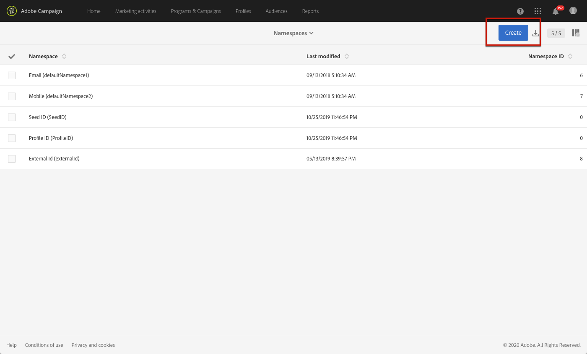
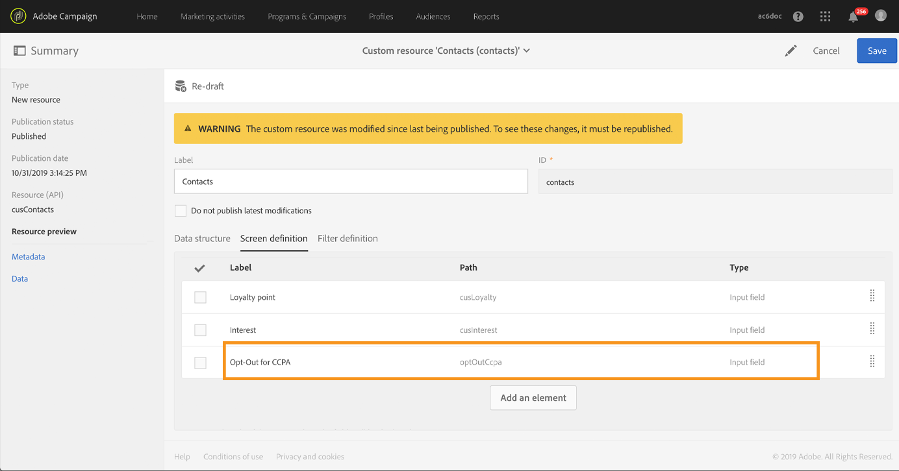

# Gestione delle richieste di accesso a dati personali {#privacy-requests}

Per una presentazione generale sulla gestione della privacy, consulta [questa sezione](../../start/using/privacy-management.md).

Queste informazioni si applicano alle normative GDPR, CCPA, PDPA e LGPD. Per ulteriori informazioni su tali normative, consulta [questa sezione](../../start/using/privacy-management.md#privacy-management-regulations).

La rinuncia alla vendita di informazioni personali, specifica del CCPA, è spiegata in [questa sezione](#sale-of-personal-information-ccpa).

>[!IMPORTANT]
>
>A partire dalla versione 19.4, l’utilizzo dell’API e dell’interfaccia di Campaign per le richieste di accesso ed eliminazione diventerà obsoleto. Per qualsiasi richiesta di accesso ed eliminazione nell’ambito di GDPR, CCPA, PDPA o LGPD, è necessario utilizzare il metodo di integrazione del [servizio core per la privacy](#create-privacy-request).

## Informazioni sulle richieste di accesso a dati personali {#about-privacy-requests}

Per aiutarti a garantire l’idoneità alle normative sulla privacy, Adobe Campaign consente di gestire le richieste di accesso ed eliminazione. Il **diritto di accesso** e il **diritto all’oblio** (richiesta di eliminazione) sono illustrati in [questa sezione](../../start/using/privacy-management.md#right-access-forgotten).

Per eseguire tali richieste, è necessario utilizzare l’integrazione del **servizio core per la privacy**. Le richieste di accesso a dati personali inviate dal servizio core per la privacy a tutte le soluzioni Experience Cloud vengono gestite automaticamente da Campaign tramite un flusso di lavoro dedicato.

### Prerequisiti {#prerequesites}

 Adobe Campaign offre ai titolari del trattamento strumenti per creare ed elaborare richieste di accesso a dati personali per i dati memorizzati in Adobe Campaign. La gestione del rapporto con l’interessato (tramite e-mail, assistenza clienti o un portale web) rimane tuttavia responsabilità del titolare del trattamento.

In qualità di titolare del trattamento, avrai pertanto la responsabilità di confermare l’identità dell’interessato che presenta la richiesta e confermare che i dati restituiti al richiedente riguardano l’interessato.

>[!NOTE]
>
>Per ulteriori informazioni sui dati personali e sulle diverse entità che gestiscono i dati (titolare del trattamento, responsabile del trattamento e interessato), consulta [Dati personali e utenti tipo](../../start/using/privacy.md#personal-data).

### Namespace {#namesspaces}

Prima di creare le richieste di accesso a dati personali, definisci lo spazio dei nomi da utilizzare. Lo spazio dei nomi è la chiave che verrà utilizzata per identificare l’interessato nel database di Adobe Campaign. Due spazi dei nomi sono disponibili da subito: e-mail e telefono cellulare. Se hai bisogno di uno spazio dei nomi diverso (ad esempio un campo personalizzato del profilo), svolgi i passaggi seguenti.

Fai inoltre riferimento a questo [tutorial](https://experienceleague.adobe.com/docs/campaign-standard-learn/tutorials/privacy/namespaces-for-privacy-requests.html?lang=it#privacy) su come creare uno spazio dei nomi.

>[!NOTE]
>
>Se utilizzi più spazi dei nomi, crea una richiesta Privacy per ogni namespace.

1. Fai clic sul logo Adobe Campaign nell’angolo in alto a sinistra, quindi seleziona **[!UICONTROL Administration]** > **[!UICONTROL Namespaces]**.

   

1. Nell’elenco degli spazi dei nomi, fai clic su **[!UICONTROL Create]**.

   

1. Inserisci un **[!UICONTROL Label]**.

   

1. Se desideri utilizzare uno spazio dei nomi esistente in Identity Service, scegli **[!UICONTROL Map from Identity Namespace Service]** e seleziona uno spazio dei nomi dall’elenco **[!UICONTROL Identity Service Namespaces]**.

   

   Se desideri creare un nuovo spazio dei nomi in **[!UICONTROL Identity Service]** e mapparlo in Campaign, seleziona **[!UICONTROL Create new]** e inserisci un nome nel campo **[!UICONTROL Identity namespace name]**.

   

   Per ulteriori informazioni sugli spazi dei nomi di identità, consulta la documentazione di [Experience Platform](https://experienceleague.adobe.com/docs/experience-platform/identity/namespaces.html?lang=it).

1. Uno spazio dei nomi in Identity Service è mappato a uno spazio dei nomi in Campaign. Devi specificare in che modo verrà riconciliato lo spazio dei nomi in Campaign.

   Seleziona una mappatura di destinazione (**[!UICONTROL Recipients]**, **[!UICONTROL Real-time event]** o **[!UICONTROL Subscriptions to an application]**). Se desideri utilizzare diverse mappature di destinazione, crea un namespace per ogni mappatura di destinazione.

   

1. Scegli la **[!UICONTROL Reconciliation key]**. Questo campo verrà utilizzato per identificare l’interessato nel database di Adobe Campaign.

   

1. Fai clic su **[!UICONTROL Create]**. Ora puoi creare richieste di accesso a dati personali in base al nuovo spazio dei nomi. Se utilizzi più spazi dei nomi, crea una richiesta Privacy per ogni namespace.

### Creazione di una richiesta di accesso a dati personali {#create-privacy-request}

>[!IMPORTANT]
>
>L’integrazione del **servizio core per la privacy** è il metodo da utilizzare per tutte le richieste di accesso ed eliminazione.
>
>A partire dalla versione 19.4, l’utilizzo dell’API e dell’interfaccia di Campaign per le richieste di accesso ed eliminazione diventerà obsoleto. Utilizza il servizio core per la privacy per qualsiasi richiesta di accesso ed eliminazione relativa alle normative GDPR, CCPA, PDPA o LGPD.

L’integrazione del servizio core per la privacy consente di automatizzare le richieste di accesso a dati personali in un contesto multisoluzione tramite una singola chiamata API JSON. Le richieste di accesso a dati personali inviate dal servizio core per la privacy a tutte le soluzioni Experience Cloud vengono gestite automaticamente da Campaign tramite un flusso di lavoro dedicato.

Per scoprire come creare richieste di accesso a dati personali dal servizio core per la privacy, fai riferimento alla documentazione del [Privacy Service di Experience Platform](https://experienceleague.adobe.com/docs/experience-platform/privacy/home.html?lang=it).

Ciascun processo del servizio core per la privacy è suddiviso in più richieste di accesso a dati personali in Campaign in base al numero di spazi dei nomi utilizzati. A ogni richiesta corrisponde uno spazio dei nomi. È inoltre possibile eseguire un processo su più istanze. In questo caso vengono creati più file per un processo. Ad esempio, se una richiesta ha due spazi di nomi ed è in esecuzione in tre istanze, vengono inviati in totale sei file. Un file per ogni spazio dei nomi e istanza.

Il modello per il nome di un file è: `<InstanceName>-<NamespaceId>-<ReconciliationKey>.xml`

* **InstanceName**: il nome dell’istanza Campaign
* **NamespaceId**: l’ID spazio dei nomi di Identity Service per lo spazio dei nomi utilizzato
* **ReconciliationKey**: la chiave di riconciliazione codificata

### Elenco delle risorse {#list-of-resources}

Durante l’esecuzione di una richiesta di eliminazione o di accesso ai dati personali, Adobe Campaign cerca tutti i dati dell’interessato in base al valore **Riconciliazione** in tutte le risorse che presentano un collegamento alla risorsa profili (di tipo proprio).

Di seguito è riportato l’elenco delle risorse pronte all’uso prese in considerazione per l’esecuzione delle richieste di accesso a dati personali:

* Profili (destinatario)
* Registri di consegna del profilo (broadLogRcp)
* Registri di tracciamento del profilo (trackingLogRcp)
* Registri di consegna (abbonamenti a un’applicazione) (broadLogAppSubRcp)
* Registri di tracciamento (abbonamenti a un’applicazione) (trackingLogAppSubRcp)
* Abbonamenti a un’applicazione (appSubscriptionRcp)
* Cronologia degli abbonamenti dei profili (subHistoRcp)
* Abbonamenti del profilo (subscriptionRcp)
* Visitatori (visitor)

Se hai creato risorse personalizzate con un collegamento alla risorsa profili (di tipo proprio), esse verranno tenute in considerazione. Ad esempio, se disponi di una risorsa di transazione collegata alla risorsa profili e una risorsa dei dettagli della transazione collegata alla risorsa della transazione, verranno prese in considerazione entrambe.

Fai inoltre riferimento a [questo tutorial](https://experienceleague.adobe.com/docs/campaign-standard-learn/tutorials/privacy/custom-resources-for-privacy-requests.html?lang=it#privacy) su come modificare le risorse personalizzate.

Affinché questo funzioni, devi selezionare l’opzione **[!UICONTROL Deleting the target record implies deleting records referenced by the link]** nella risorsa personalizzata:

1. Fai clic sul logo Adobe Campaign nell’angolo in alto a sinistra, quindi seleziona **[!UICONTROL Administration]** > **[!UICONTROL Development]** > **[!UICONTROL Custom resources]**.

1. Seleziona una risorsa personalizzata contenente un collegamento alla risorsa profili (di tipo proprio).

1. Fai clic sulla sezione **[!UICONTROL Links]**.

1. Per ogni collegamento, fai clic sull’icona della matita (**[!UICONTROL Edit properties]**).

1. Nella sezione **[!UICONTROL Behavior if deleted/duplicated]**, seleziona l’opzione **[!UICONTROL Deleting the target record implies deleting records referenced by the link]**.

   

### Stati delle richieste di accesso a dati personali {#privacy-request-statuses}

Di seguito sono riportati i diversi stati delle richieste di accesso a dati personali:

* **[!UICONTROL New]** / **[!UICONTROL Retry pending]**: in corso, il flusso di lavoro non ha ancora elaborato la richiesta.
* **[!UICONTROL Processing]** / **[!UICONTROL Retry in progress]**: il flusso di lavoro sta elaborando la richiesta.
* **[!UICONTROL Delete pending]**: il flusso di lavoro ha identificato tutti i dati del destinatario da eliminare.
* **[!UICONTROL Delete in progress]**: il flusso di lavoro sta elaborando l’eliminazione.
   <!--**[!UICONTROL Delete Confirmation Pending]** (Delete request in 2-steps process mode): the workflow has processed the Access request. Manual confirmation is requested to perform the deletion. The button is available for 15 days.-->
* **[!UICONTROL Complete]**: l’elaborazione della richiesta è andata a buon fine.
* **[!UICONTROL Error]**: il flusso di lavoro ha rilevato un errore. Il motivo viene visualizzato nell’elenco delle richieste di accesso a dati personali nella colonna **[!UICONTROL Request status]**. Ad esempio, **[!UICONTROL Error data not found]** significa che nel database non è stato trovato nessun dato del destinatario corrispondente al **[!UICONTROL Reconciliation value]** dell’interessato.

<!--### Disabling the 2-step process {#disabling-two-step-process}

The Core Privacy Service does not support the 2-step process.

>[!IMPORTANT]
>
>Before using the Core Privacy Service integration to manage your Privacy requests, you must disable the 2-step process for Delete requests from the Campaign Standard interface.

If this option is not disabled, all Delete requests managed with the Privacy Core Service will remain in pending state and will not complete.

By default, the 2-step process is activated.

To change this mode, click **[!UICONTROL Edit properties]**, in the top right corner of the **[!UICONTROL Privacy Requests]** screen, then uncheck the **[!UICONTROL Activate the 2-step process]** option.

-->

## Rinuncia alla vendita di informazioni personali (CCPA) {#sale-of-personal-information-ccpa}

Il **California Consumer Privacy Act** (CCPA) fornisce ai residenti della California nuovi diritti in merito alle loro informazioni personali e impone responsabilità in materia di protezione dei dati a determinate entità che conducono attività commerciali in California.

La configurazione e l’utilizzo delle richieste di accesso ed eliminazione sono comuni sia al GDPR che al CCPA. Questa sezione presenta la rinuncia alla vendita di dati personali, specifica del CCPA.

Oltre a utilizzare gli strumenti di [gestione del consenso](../../start/using/privacy-management.md#consent-management) forniti da Adobe Campaign, puoi verificare se un consumatore ha rinunciato alla vendita di informazioni personali.

Quando gli utenti decidono, tramite il tuo sistema, che non consentono la vendita dei loro dati personali a terzi, sarai in grado di archiviare e tenere traccia di tali informazioni.

>[!NOTE]
>
>Puoi sfruttare la rinuncia alla vendita di informazioni personali tramite l’interfaccia Campaign e tramite l’API. Non puoi invece utilizzarla tramite il servizio core per la privacy.

>[!IMPORTANT]
>
>In qualità di titolare del trattamento è tua responsabilità ricevere la richiesta dell’interessato e tenere traccia delle date della richiesta in conformità con il CCPA. In qualità di fornitore di tecnologia, ci limitiamo a offrire un modo per esprimere la rinuncia. Per ulteriori informazioni sul tuo ruolo in quanto titolare del trattamento, consulta [Dati personali e utenti tipo](../../start/using/privacy.md#personal-data).

### Prerequisito per le tabelle personalizzate {#ccpa-prerequisite}

A partire dalla versione 19.4, il campo **[!UICONTROL CCPA Opt-Out]** è disponibile da subito nell’interfaccia e nell’API di Campaign. Per impostazione predefinita, il campo è disponibile per la risorsa **[!UICONTROL Profile]** standard.

Se utilizzi una risorsa di profilo personalizzata, devi estendere la risorsa e aggiungere il campo . È consigliabile utilizzare un nome diverso rispetto al campo predefinito, ad esempio: **[!UICONTROL Opt-Out for CCPA]** (optoutccpa). Quando viene creato un nuovo campo, questo viene automaticamente supportato dall’API di Campaign.

Per informazioni dettagliate su come estendere la risorsa profilo, consulta [questa sezione](../../developing/using/extending-the-profile-resource-with-a-new-field.md).

>[!NOTE]
>
>La modifica delle risorse è un’operazione delicata e deve essere eseguita solo da utenti esperti.

1. Vai a **[!UICONTROL Administration]** > **[!UICONTROL Development]** > **[!UICONTROL Custom Resources]**. Fai clic sulla risorsa profilo personalizzata. Per ulteriori informazioni sull’estensione di una risorsa, consulta [questa sezione](../../developing/using/creating-or-extending-the-resource.md).

   

1. Fai clic su **[!UICONTROL Add field]** o **[!UICONTROL Create Element]**, aggiungi l’etichetta, l’ID e scegli il tipo **[!UICONTROL Boolean]**. Per il nome, utilizza **Rinuncia per CCPA**. Per l’ID, utilizza: **optOutCcpa**.

   

1. Nella scheda **[!UICONTROL Screen definition]**, aggiungi il campo in **[!UICONTROL Detail screen configuration]** e seleziona **[!UICONTROL Input field]**. Questo renderà il campo disponibile nell’elenco e nei dettagli dei profili. Per ulteriori informazioni sulla configurazione della definizione dello schermo, consulta [questa sezione](../../developing/using/configuring-the-screen-definition.md).

   

1. Vai a **[!UICONTROL Administration]** > **[!UICONTROL Development]** > **[!UICONTROL Publishing]**, prepara la pubblicazione e pubblica le modifiche. Per ulteriori informazioni sulla pubblicazione di una risorsa, consulta [questa sezione](../../developing/using/updating-the-database-structure.md).

   

1. Verifica che il campo sia disponibile nei dettagli del profilo. Per ulteriori informazioni, consulta [questa sezione](#usage).

### Utilizzo {#usage}

Compilare il valore del campo e seguire le linee guida e le regole del CCPA relative alla vendita dei dati è responsabilità del titolare del trattamento.

Sono disponibili diversi metodi per compilare i valori:

* Utilizzare l’interfaccia di Campaign modificando i dettagli del destinatario (vedi sotto)
* Utilizzare l’API di Campaign per la privacy (consulta la [documentazione dell’API](../../api/using/managing-ccpa-opt-out.md))
* Mediante un flusso di lavoro di importazione dati

Accertati di non vendere mai a terzi le informazioni personali dei profili che hanno espresso la rinuncia.

1. Nell’interfaccia di Campaign, modifica un profilo per modificare lo stato di rinuncia.

   

1. Quando il valore del campo è **[!UICONTROL True]**, le informazioni vengono visualizzate nei dettagli del profilo.

   

1. Puoi configurare l’elenco dei profili per visualizzare la colonna della rinuncia. Per informazioni sulla configurazione degli elenchi, consulta [questa sezione](../../start/using/customizing-lists.md).

   

1. Fai clic sulla colonna per ordinare i destinatari in base alle informazioni di rinuncia.

   
