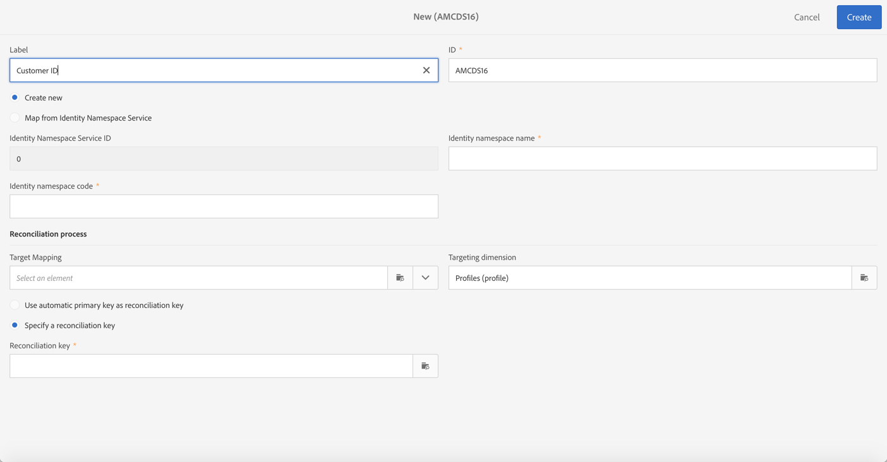
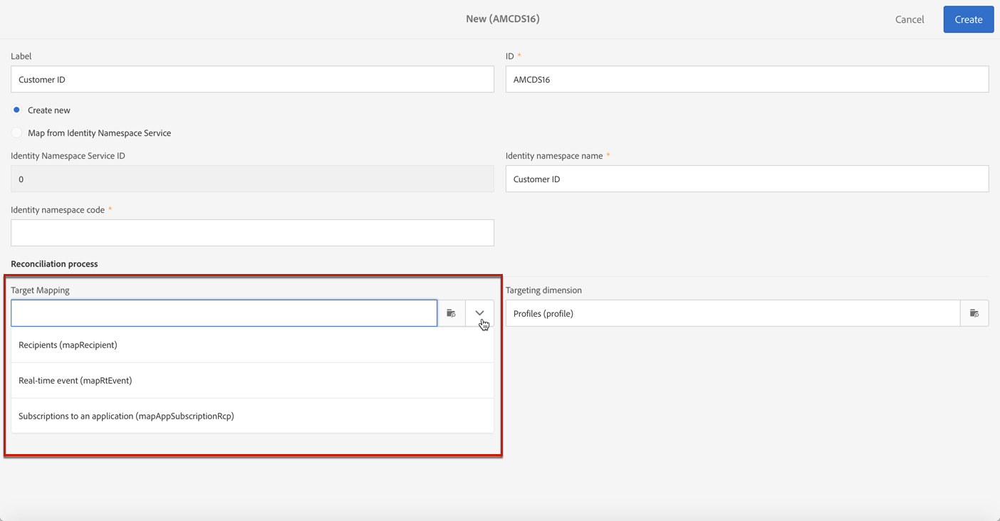

# Gestione delle richieste di privacy {#privacy-requests}

Per una presentazione generale sulla gestione della privacy, consultare [questa sezione](../../start/using/privacy-management.md).

Queste informazioni si applicano a GDPR, CCPA, PDPA e LGPD. For more on these regulations, see [this section](../../start/using/privacy-management.md#privacy-management-regulations).

La rinuncia alla vendita di informazioni personali, che è specifica dell&#39;CCPA, è spiegata in [questa sezione](#sale-of-personal-information-ccpa).

>[!IMPORTANT]
>
>A partire dalla versione 19.4, l&#39;utilizzo dell&#39;API Campaign e dell&#39;interfaccia per le richieste di accesso ed eliminazione è diventato obsoleto. Per qualsiasi richiesta di accesso ed eliminazione a GDPR, CCPA, PDPA o LGPD, è necessario utilizzare il metodo di integrazione del servizio [di base](#create-privacy-request) Privacy.

## Informazioni sulle richieste sulla privacy {#about-privacy-requests}

Per facilitare la preparazione alla privacy,  Adobe Campaign consente di gestire le richieste di accesso ed eliminazione. In **questa sezione** sono descritti il **Diritto di accesso** e il [Diritto di essere Dimenticato](../../start/using/privacy-management.md#right-access-forgotten)(richiesta di eliminazione).

Per eseguire tali richieste, è necessario utilizzare l&#39;integrazione **Privacy Core Service** . Le richieste di privacy inviate dal servizio di base per la privacy a tutte le soluzioni  Experience Cloud vengono gestite automaticamente da Campaign tramite un flusso di lavoro dedicato.

### Prerequisiti {#prerequesites}

 Adobe Campaign offre strumenti per il controllo dei dati per creare ed elaborare richieste di privacy per i dati memorizzati  Adobe Campaign. È tuttavia responsabilità del Titolare del Trattamento dei Dati gestire il rapporto con l&#39;Oggetto dei Dati (e-mail, assistenza clienti o un portale Web).

È pertanto responsabilità dell&#39;utente in qualità di titolare del trattamento confermare l&#39;identità dell&#39;interessato che presenta la richiesta e confermare che i dati restituiti al richiedente riguardano l&#39;interessato.

>[!NOTE]
>
>Per ulteriori informazioni sui dati personali e sulle diverse entità che gestiscono i dati (Titolare del trattamento dei dati, Processore dati e Oggetto dati), consulta Dati [personali e Personas](../../start/using/privacy.md#personal-data).

### Spazi dei nomi {#namesspaces}

Prima di creare le richieste di privacy, è necessario definire lo spazio dei nomi che verrà utilizzato. Lo spazio dei nomi è la chiave che verrà utilizzata per identificare l&#39;oggetto dati nel database Adobe Campaign . Sono disponibili due spazi dei nomi out-of-the-box: e-mail e telefono cellulare. Se è necessario un diverso spazio nomi (ad esempio un campo personalizzato del profilo), procedere come segue.

Fare riferimento anche a questa [esercitazione](https://experienceleague.adobe.com/docs/campaign-standard-learn/tutorials/privacy/namespaces-for-privacy-requests.html?lang=en#privacy) su come creare uno spazio nomi.

>[!NOTE]
>
>Se si utilizzano più spazi dei nomi, sarà necessario creare una richiesta Privacy per ogni spazio dei nomi.

1. Click the Adobe Campaign logo in the top left corner, then select **[!UICONTROL Administration]** > **[!UICONTROL Namespaces]**.

   

1. Nell&#39;elenco dei namespace, fare clic su **[!UICONTROL Create]**.

   

1. Immettete un **[!UICONTROL Label]**.

   

1. Se si desidera utilizzare uno spazio dei nomi del servizio identità esistente, scegliere **[!UICONTROL Map from Identity Namespace Service]** e selezionare uno spazio dei nomi dall&#39; **[!UICONTROL Identity Service Namespaces]** elenco.

   

   Se desiderate creare un nuovo spazio nomi in **[!UICONTROL Identity Service]** e mapparlo in Campaign, selezionate **[!UICONTROL Create new]** e immettete un nome nel **[!UICONTROL Identity namespace name]** campo.

   

   Per ulteriori informazioni sugli spazi dei nomi delle identità, consulta la documentazione [Experience Platform](https://experienceleague.adobe.com/docs/experience-platform/identity/namespaces.html?lang=en) .

1. Uno spazio dei nomi del servizio identità è mappato a uno spazio dei nomi in Campaign. È necessario specificare in che modo lo spazio nomi verrà riconciliato in Campaign.

   Selezionate una mappatura di destinazione (**[!UICONTROL Recipients]**, **[!UICONTROL Real-time event]** o **[!UICONTROL Subscriptions to an application]**). Per utilizzare più mappature di destinazione, è necessario creare un namespace per mappatura di destinazione.

   

1. Scegli il **[!UICONTROL Reconciliation key]**. Questo è il campo che verrà utilizzato per identificare l&#39;oggetto dati nel database Adobe Campaign .

   

1. Fai clic su **[!UICONTROL Create]**. È ora possibile creare richieste di privacy in base al nuovo spazio dei nomi. Se si utilizzano più spazi dei nomi, sarà necessario creare una richiesta Privacy per ogni spazio dei nomi.

### Creating a Privacy request {#create-privacy-request}

>[!IMPORTANT]
>
>L&#39;integrazione del servizio **di base** Privacy è il metodo da utilizzare per tutte le richieste di accesso ed eliminazione.
>
>A partire dalla versione 19.4, l&#39;utilizzo dell&#39;API Campaign e dell&#39;interfaccia per le richieste di accesso ed eliminazione è diventato obsoleto. Utilizzate il Privacy Service Core per qualsiasi richiesta di accesso ed eliminazione a GDPR, CCPA, PDPA o LGPD.

L’integrazione del servizio di base per la privacy consente di automatizzare le richieste di privacy in un contesto multisoluzione tramite una singola chiamata API JSON. Le richieste di privacy inviate dal servizio di base per la privacy a tutte le soluzioni  Experience Cloud vengono gestite automaticamente da Campaign tramite un flusso di lavoro dedicato.

Per informazioni su come creare richieste di privacy dal servizio di base sulla privacy, fare riferimento alla documentazione [Experience Platform](https://experienceleague.adobe.com/docs/experience-platform/privacy/home.html?lang=en) .

Ciascun processo del servizio di base Privacy è suddiviso in più richieste di privacy in Campaign in base al numero di spazi dei nomi utilizzati, una richiesta corrispondente a uno spazio dei nomi. È inoltre possibile eseguire un processo su più istanze. Vengono quindi creati più file per un processo. Ad esempio, se una richiesta ha due spazi di nomi ed è in esecuzione in tre istanze, vengono inviati in totale sei file. Un file per namespace e istanza.

Il pattern per il nome di un file è: `<InstanceName>-<NamespaceId>-<ReconciliationKey>.xml`

* **NomeIstanza**: Nome istanza campagna
* **NamespaceId**: ID spazio nomi servizio identità dello spazio dei nomi utilizzato
* **Chiave** di riconciliazione: Chiave di riconciliazione codificata

### Elenco delle risorse {#list-of-resources}

Durante l&#39;esecuzione di una richiesta di eliminazione o di accesso alla privacy,  Adobe Campaign cerca tutti i dati dell&#39;oggetto dati in base al valore **Riconciliazione** in tutte le risorse che dispongono di un collegamento alla risorsa dei profili (tipo proprio).

Di seguito è riportato l&#39;elenco delle risorse pronte all&#39;uso che vengono prese in considerazione per l&#39;esecuzione delle richieste di privacy:

* Profili (destinatario)
* Registri di distribuzione dei profili (wideLogRcp)
* Registri di tracciamento del profilo (trackingLogRcp)
* Registri di distribuzione (iscrizioni a un&#39;applicazione) (wideLogAppSubRcp)
* Registri di monitoraggio (iscrizioni a un&#39;applicazione) (trackingLogAppSubRcp)
* Iscrizioni a un&#39;applicazione (appSubscriptionRcp)
* Cronologia iscrizioni dei profili (subHistoRcp)
* Iscrizioni profilo (subscriptionRcp)
* Visitatori (visitatore)

Se hai creato risorse personalizzate con un collegamento alla risorsa dei profili (tipo proprio), ne verrai tenuto conto. Ad esempio, se hai una risorsa transazione collegata alla risorsa dei profili e una risorsa dei dettagli della transazione collegata alla risorsa della transazione, entrambi verranno presi in considerazione.

Fate inoltre riferimento a [questa esercitazione](https://experienceleague.adobe.com/docs/campaign-standard-learn/tutorials/privacy/custom-resources-for-privacy-requests.html?lang=en#privacy) su come modificare le risorse personalizzate.

Affinché questo funzioni, è necessario selezionare l&#39; **[!UICONTROL Deleting the target record implies deleting records referenced by the link]** opzione nella risorsa personalizzata:

1. Click the Adobe Campaign logo in the top left corner, then select **[!UICONTROL Administration]** > **[!UICONTROL Development]** > **[!UICONTROL Custom resources]**.

1. Selezionate una risorsa personalizzata con un collegamento alla risorsa dei profili (tipo proprio).

1. Fare clic sulla **[!UICONTROL Links]** sezione.

1. Per ogni collegamento, fai clic sull’icona matita (**[!UICONTROL Edit properties]**).

1. In the **[!UICONTROL Behavior if deleted/duplicated]** section, select the **[!UICONTROL Deleting the target record implies deleting records referenced by the link]** option.

   

### Stati della richiesta di privacy {#privacy-request-statuses}

Di seguito sono riportati i diversi stati per le richieste di privacy:

* **[!UICONTROL New]** / **[!UICONTROL Retry pending]**: in corso, il flusso di lavoro non ha ancora elaborato la richiesta.
* **[!UICONTROL Processing]** / **[!UICONTROL Retry in progress]**: il flusso di lavoro sta elaborando la richiesta.
* **[!UICONTROL Delete pending]**: il flusso di lavoro ha identificato tutti i dati del destinatario da eliminare.
* **[!UICONTROL Delete in progress]**: il flusso di lavoro sta elaborando l&#39;eliminazione.
   <!--**[!UICONTROL Delete Confirmation Pending]** (Delete request in 2-steps process mode): the workflow has processed the Access request. Manual confirmation is requested to perform the deletion. The button is available for 15 days.-->
* **[!UICONTROL Complete]**: l&#39;elaborazione della richiesta è terminata senza un errore.
* **[!UICONTROL Error]**: errore rilevato dal flusso di lavoro. Il motivo viene visualizzato nell’elenco delle richieste di privacy nella **[!UICONTROL Request status]** colonna. Ad esempio, **[!UICONTROL Error data not found]** significa che nel database non **[!UICONTROL Reconciliation value]** è stato trovato alcun dato destinatario corrispondente a quello dell&#39;oggetto dati.

### Disattivazione del processo in due fasi {#disabling-two-step-process}

Il Privacy Service Core non supporta il processo in due fasi.

>[!IMPORTANT]
>
>Prima di utilizzare l&#39;integrazione dei Privacy Service di base per gestire le richieste di privacy, è necessario disabilitare il processo in due fasi per le richieste di eliminazione dall&#39;interfaccia Campaign Standard.

Se questa opzione non è disabilitata, tutte le richieste di eliminazione gestite con il servizio di base sulla privacy rimarranno in sospeso e non verranno completate.

Per impostazione predefinita, il processo in due fasi è attivato.

Per modificare questa modalità, fate clic **[!UICONTROL Edit properties]**, nell’angolo in alto a destra della **[!UICONTROL Privacy Requests]** schermata, quindi deselezionate l’ **[!UICONTROL Activate the 2-step process]** opzione.

## Rinuncia alla vendita di informazioni personali (CCPA) {#sale-of-personal-information-ccpa}

The **California Consumer Privacy Act** (CCPA) provides California residents new rights in regards to their personal information and imposes data protection responsibilities on certain entities whom conduct business in California.

La configurazione e l’utilizzo delle richieste di accesso ed eliminazione sono comuni sia al GDPR che all’APP. Questa sezione presenta la rinuncia alla vendita di dati personali, che è specifica dell&#39;CCPA.

Oltre agli strumenti di gestione [del](../../start/using/privacy-management.md#consent-management) consenso forniti da  Adobe Campaign, è possibile verificare se un consumatore ha rinunciato alla vendita di Informazioni personali.

Un consumatore decide, attraverso il tuo sistema, di non consentire la vendita dei suoi dati personali a terzi. In  Adobe Campaign, potrete archiviare e tenere traccia di queste informazioni.

>[!NOTE]
>
>Puoi sfruttare la rinuncia per la vendita di informazioni personali tramite l&#39;interfaccia Campaign e tramite l&#39;API. Non è possibile utilizzarlo tramite il servizio di base sulla privacy.

>[!IMPORTANT]
>
>In qualità di titolare del trattamento è responsabilità dell&#39;utente ricevere la richiesta dell&#39;interessato e tenere traccia delle date della richiesta per l&#39;accordo CCPA. In qualità di fornitore di tecnologia, forniamo solo un modo per rifiutare. Per ulteriori informazioni sul tuo ruolo di Controller dati, consulta Dati [personali e Personas](../../start/using/privacy.md#personal-data).

### Prerequisito per le tabelle personalizzate {#ccpa-prerequisite}

A partire dalla versione 19.4, il **[!UICONTROL CCPA Opt-Out]** campo viene fornito out-of-the-box nell&#39;interfaccia e nell&#39;API di Campaign. Per impostazione predefinita, il campo è disponibile per la **[!UICONTROL Profile]** risorsa standard.

Se utilizzate una risorsa di profilo personalizzata, dovete estendere la risorsa e aggiungere il campo. È consigliabile utilizzare un nome diverso rispetto al campo out-of-the-box, ad esempio:  **[!UICONTROL Opt-Out for CCPA]** (optoutccpa). Quando viene creato un nuovo campo, questo viene automaticamente supportato dall&#39;API Campaign.

Per informazioni dettagliate su come estendere la risorsa del profilo, consulta [questa sezione](../../developing/using/extending-the-profile-resource-with-a-new-field.md).

>[!NOTE]
>
>La modifica delle risorse è un’operazione sensibile che deve essere eseguita solo da utenti esperti.

1. Vai a **[!UICONTROL Administration]** > **[!UICONTROL Development]** > **[!UICONTROL Custom Resources]**. Fate clic sulla risorsa profilo personalizzata. Per ulteriori informazioni sull’estensione di una risorsa, consultate [questa sezione](../../developing/using/creating-or-extending-the-resource.md).

   

1. Fate clic **[!UICONTROL Add field]** o **[!UICONTROL Create Element]**, aggiungete l’etichetta, l’ID e scegliete il **[!UICONTROL Boolean]** tipo. Per il nome, utilizzate **Rifiuto per CCPA**. Per l’ID, utilizza: **optOutCcpa**.

   

1. Nella **[!UICONTROL Screen definition]** scheda, in **[!UICONTROL Detail screen configuration]**, aggiungere il campo e selezionare **[!UICONTROL Input field]**. Questo renderà il campo disponibile nell&#39;elenco dei profili e nei dettagli.  Per ulteriori informazioni sulla configurazione della definizione dello schermo, vedere [questa sezione](../../developing/using/configuring-the-screen-definition.md).

   

1. Vai a **[!UICONTROL Administration]** > **[!UICONTROL Development]** > **[!UICONTROL Publishing]**, prepara la pubblicazione e pubblica le modifiche. Per ulteriori informazioni sulla pubblicazione di una risorsa, consultate [questa sezione](../../developing/using/updating-the-database-structure.md).

   

1. Verifica che il campo sia disponibile nei dettagli di un profilo. Per ulteriori informazioni, consulta [questa sezione](#usage).

### Utilizzo {#usage}

È responsabilità del titolare del trattamento compilare il valore del campo e seguire le linee guida e le regole CCPA relative alla vendita dei dati.

Per compilare i valori, è possibile utilizzare diversi metodi:

* Utilizzo dell&#39;interfaccia di Campaign modificando i dettagli del destinatario (vedi sotto)
* Utilizzo dell&#39;API per la privacy della campagna (consultate la documentazione API)
* Mediante un flusso di lavoro di importazione dei dati

Devi accertarti di non vendere mai a terzi le informazioni personali dei profili che hanno rinunciato.

1. Nell&#39;interfaccia della campagna, modifica un profilo per modificare lo stato di rifiuto.

   

1. Quando il valore del campo è **[!UICONTROL True]**, le informazioni vengono visualizzate nei dettagli del profilo.

   

1. Potete configurare l’elenco dei profili per visualizzare la colonna a comparsa. Per informazioni su come configurare gli elenchi, vedere [questa sezione](../../start/using/customizing-lists.md).

   

1. Potete fare clic sulla colonna per ordinare i destinatari in base alle informazioni di rifiuto.

   
