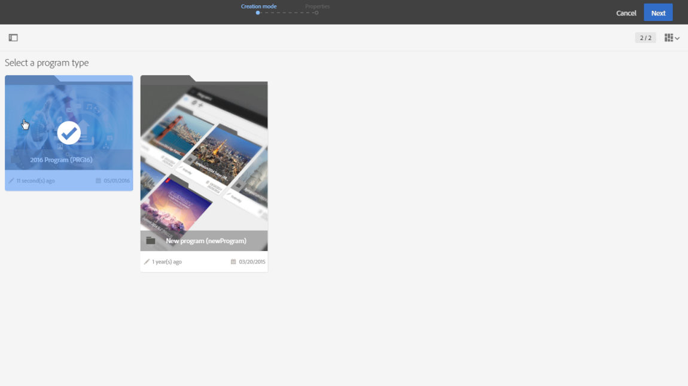

# Programmi e campagne{#programs-and-campaigns}

## Informazioni su piani, programmi e campagne {#about-plans--programs-and-campaigns}

Adobe Campaign ti consente di pianificare le campagne di marketing in cui creare e gestire vari tipi di attività: e-mail, messaggi SMS, notifiche push, flussi di lavoro, pagine di destinazione. Tali campagne e il relativo contenuto possono essere raccolti all’interno di programmi.

I programmi e le campagne ti consentono di raggruppare e visualizzare le varie attività di marketing collegate.

* Un **programma** può contenere altri programmi, oltre a campagne, flussi di lavoro e pagine di destinazione. Viene visualizzato nella timeline e ti consente di organizzare le attività di marketing: puoi separarli per paese, per brand, per unità e così via.
* Una **campagna** ti permette di raccogliere tutte le attività di marketing che desideri sotto un’unica entità. Una campagna può contenere e-mail, SMS, notifiche push, direct mailing, flussi di lavoro e pagine di destinazione.

Per una migliore organizzazione dei piani di marketing, Adobe consiglia di seguire la gerarchia: Programma > Sottoprogrammi > Campagne > Flussi di lavoro > Consegne.

I report su programmi e campagne consentono di analizzarne l’impatto. Ad esempio, puoi creare report a livello di campagna per aggregare i dati relativi a tutte le consegne contenute in quella campagna.

**Argomenti correlati:**

* [Timeline](../../start/using/timeline.md)
* [Informazioni sui report dinamici](../../reporting/using/about-dynamic-reports.md)

## Creazione di un programma {#creating-a-program}

Il programma rappresenta il primo livello di organizzazione. Può contenere sottoprogrammi, campagne, flussi di lavoro o pagine di destinazione.

1. Dalla pagina Home di Adobe Campaign, seleziona la scheda **[!UICONTROL Programs & Campaigns]**.
1. Fai clic sul pulsante **[!UICONTROL Create]**.
1. Nella schermata **[!UICONTROL Creation mode]**, seleziona un tipo di programma.

   

   I tipi di programma disponibili sono basati su modelli definiti nella sezione **[!UICONTROL Resources]** > **[!UICONTROL Templates]** > **[!UICONTROL Program templates]**. Per ulteriori informazioni, consulta la sezione [Gestione dei modelli](../../start/using/marketing-activity-templates.md) .

1. Nella schermata **[!UICONTROL Properties]**, immetti il nome e l’ID del programma.

   

1. Seleziona una data di inizio e di fine per il programma. Tali date si applicano solo al programma stesso.

   Puoi creare il programma all’interno di un programma principale. A questo scopo, seleziona il programma principale da quelli esistenti.

1. Fai clic su **[!UICONTROL Create]** per confermare la creazione del programma.

Il programma viene creato e visualizzato. Utilizza il pulsante **[!UICONTROL Create]** per aggiungere sottoprogrammi, campagne, flussi di lavoro o pagine di destinazione.

>[!NOTE]
>
>Puoi anche creare un programma dall’elenco delle attività di marketing.

## Creazione di una campagna {#creating-a-campaign}

Nei programmi e sottoprogrammi è possibile aggiungere le campagne. Le campagne possono contenere attività di marketing come e-mail, SMS, notifiche push, flussi di lavoro e pagine di destinazione.

1. Dalla pagina Home di Adobe Campaign, seleziona la scheda **[!UICONTROL Programs & Campaigns]** e accedi a un programma o a un sottoprogramma.
1. Fai clic sul pulsante **[!UICONTROL Create]** e seleziona **[!UICONTROL Campaign]**.
1. Nella schermata **[!UICONTROL Creation mode]**, seleziona un tipo di campagna.

   

   I tipi di campagna disponibili sono basati su modelli definiti in **[!UICONTROL Resources]** > **[!UICONTROL Templates]** > **[!UICONTROL Campaign templates]**. Per ulteriori informazioni, consulta la sezione [Gestione dei modelli](../../start/using/marketing-activity-templates.md) .

1. Nella schermata **[!UICONTROL Properties]**, immetti il nome e l’ID della campagna.
1. Seleziona una data di inizio e di fine per la campagna. Tali date si applicano solo alla campagna.

   

1. Fai clic su **[!UICONTROL Create]** per confermare la creazione della campagna.

La campagna viene creata e visualizzata. Utilizza il pulsante **[!UICONTROL Create]** per aggiungere attività di marketing alla campagna.

>[!NOTE]
>
>A seconda del contratto di licenza, è possibile accedere solo ad alcune di queste attività.

Puoi anche creare una campagna dall’elenco delle attività di marketing. Puoi scegliere di collegare l’attività di marketing a un programma principale o a un sottoprogramma tramite la finestra delle proprietà della campagna.

## Icone e stati di programmi e campagne {#programs-and-campaigns-icons-and-statuses}

Ogni programma e campagna presente nell’elenco dispone di un simbolo visivo e di un’icona il cui colore indica lo stato di esecuzione. Tale stato dipende dal periodo di validità del programma o della campagna.

* Grigio: il programma/campagna non è ancora iniziato - stato **[!UICONTROL Editing]**.
* Blu: il programma/campagna è in corso - stato **[!UICONTROL In progress]**.
* Verde: il programma/campagna è terminato - stato **[!UICONTROL Finished]**. Per impostazione predefinita, la data corrente viene visualizzata automaticamente come data di inizio validità, mentre la data di fine viene calcolata in base alla data di inizio (**D+186 giorni**). Puoi modificare queste date nelle proprietà del programma o della campagna.

