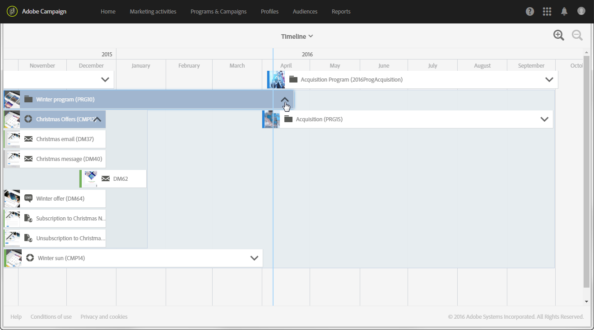

# Timeline{#timeline}

La **[!UICONTROL Timeline]** ti consente di visualizzare i programmi in corso e i relativi contenuti.

Per accedere alla timeline, fai clic sulla scheda corrispondente dalla pagina Home.

Per impostazione predefinita, la timeline fornisce solo i dettagli dei programmi, visualizzati in ordine cronologico tra le date di inizio e di fine definite.

Ciascun programma è rappresentato da una casella contenente la miniatura e l’etichetta corrispondenti. A seconda delle dimensioni della schermata e del numero di elementi da visualizzare, l’etichetta può essere sostituita dall’ID del programma.

La linea verticale blu è un indicatore cronologico per evidenziare la data corrente. Per impostazione predefinita, si trova al centro della schermata. Puoi scorrere a destra o a sinistra all’interno della schermata per modificare il periodo visualizzato.

Utilizzate le icone per:

*  ridurre il perimetro o aumentare il livello di dettaglio per un periodo più limitato, fino alla visualizzazione dei giorni
*  aumentare il perimetro o visualizzare un intervallo di tempo più ampio

Fai clic sulla freccia a destra del nome di ciascun programma per visualizzare il contenuto corrispondente. Un programma può contenere programmi secondari, campagne e pagine di destinazione. Una campagna viene distribuita allo stesso modo di un programma e può contenere e-mail, SMS e pagine di destinazione.

>[!NOTE]
>
>Poiché i flussi di lavoro non hanno una nozione particolare di data, non vengono visualizzati nella timeline.

Quando viene visualizzato il contenuto di un programma o di una campagna, la casella corrispondente diventa blu e la freccia a destra si capovolge. Fai nuovamente clic sulla freccia per nascondere il contenuto.

Ciascun elemento ha un’icona che corrisponde al relativo tipo:

*  programma
*  campagna
*  pagina di destinazione
*  e-mail
*  SMS
*  notifica push

La linea colorata sul bordo sinistro di ciascuna casella indica lo stato dell’elemento interessato.

* Quando un elemento non è ancora iniziato, la linea è grigia.
* Se un elemento è in corso, la linea è blu.
* Al termine di un elemento, la linea diventa verde.

Fai clic su un programma o su qualsiasi altro elemento visualizzato per visualizzare la scheda corrispondente. Fai clic sulla scheda per passare direttamente al contenuto dell’elemento selezionato e modificarlo.

Fai clic in un altro punto della schermata per far scomparire la scheda.
