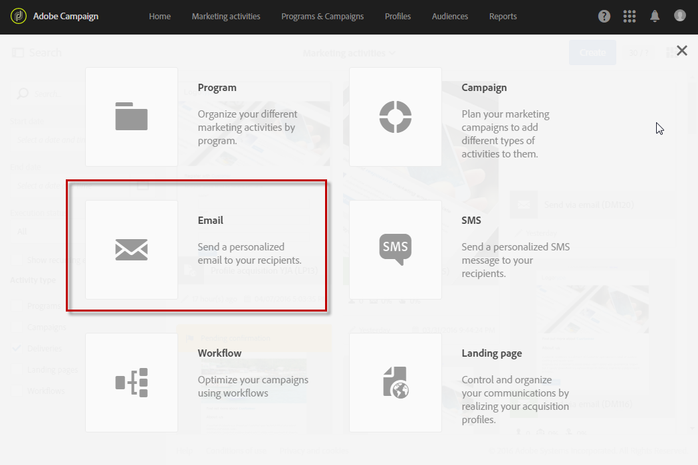

# Utilizzo di un modello{#using-a-template}

Adesso vedremo come utilizzare il modello e-mail creato nella sezione precedente.

>[!NOTE]
>
>La creazione di un'attività di marketing basata su un modello viene generalmente eseguita da un profilo di tipo utente standard.

1. Crea una nuova attività di marketing.

   

1. Nella prima schermata della procedura guidata, selezionate il modello da utilizzare.

   

   L'attività di marketing è preconfigurata con i parametri definiti nel modello.

   

